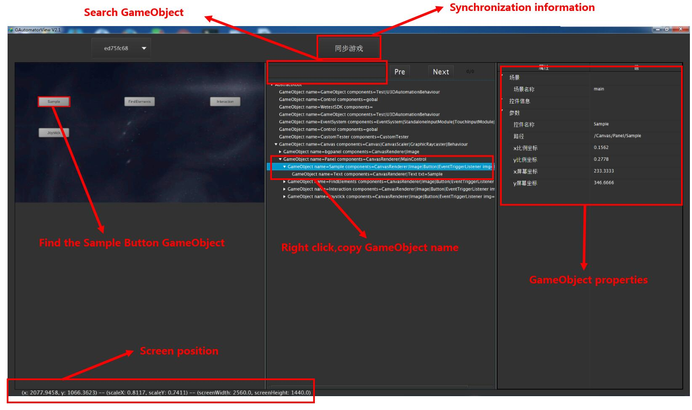
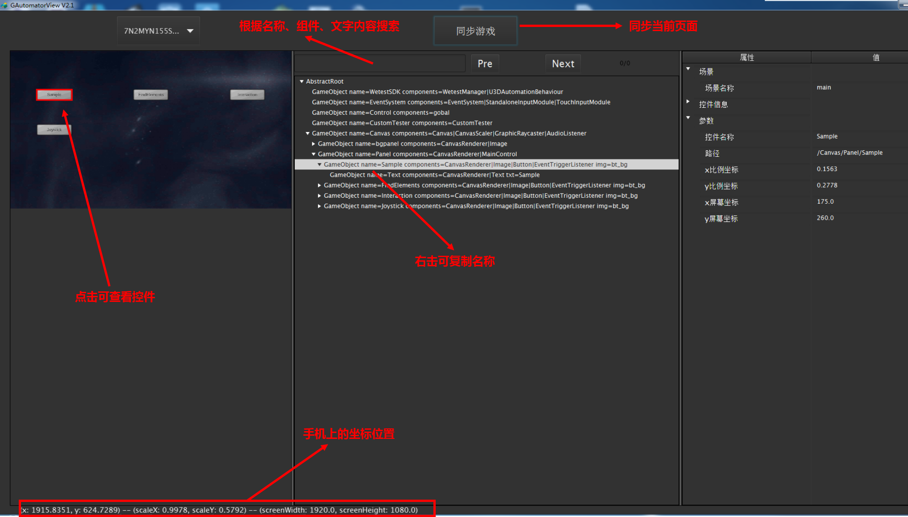
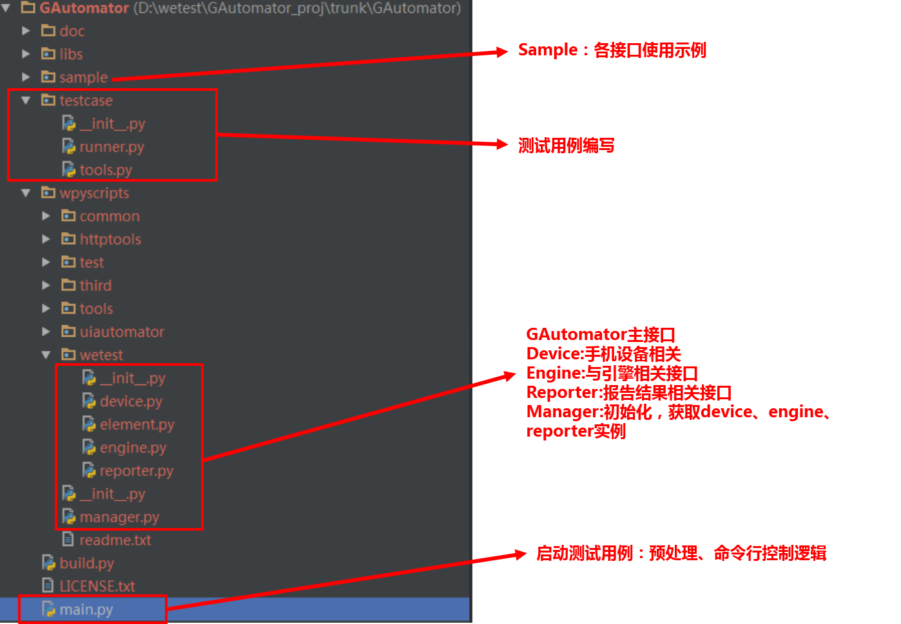

# GAutomatorAndroid
[](wetest.qq.com)  [](https://github.com/Tencent/tinker/blob/master/LICENSE)

GAutomatorAndroid, designed just like android uiautomator, also includes ui automator functions. GAutomator interacts with engine elements such as GameObject(GameObjects are the fundamental objects in Unity that represent characters, props and scenery) .


## 1 System Requirements
- python 2.7/3.4+
- Android SDK(or adb),Enable ADB setting on device and connect your android device using usb with your PC.

**Android**:
Android 4.3 (API level 18) or higher.

## 2 Writing Tests for GAutomatorAndroid

GAutomtor tested game needs to be integrated **SDK**
,[GAutomator SDK](bin "SDK") and [SDK integration tutorial](doc/GAutomator%E6%B5%8B%E8%AF%95%E6%B8%B8%E6%88%8F%E9%9B%86%E6%88%90WeTest%20SDK.md "SDK"). There are scripts in  Sample directory to test [demo game](https://cdn.wetest.qq.com/com/c/wetest_demo_unity.apk), which would be a good tutorial  for automated practice.[GAutomator Documentation](GAutomator%E4%BD%BF%E7%94%A8%E8%AF%B4%E6%98%8E%E6%96%87%E6%A1%A3.md "Document")，start your fisrt unity game automation. Just like uiautomatorviewer,GAutomatorViewer can help you inspect the UI of an application in order to find the layout hierarchy, and view the properties associated with the controls.[GAutomatorView](http://cdn.wetest.qq.com/com/c/GAutomatorView.zip) This tool is very helpful as it exposes the GameObject name and other attributes of an GameObject, which is needed for writing scripts,[GAutomatorView Documentation](doc/GAutomatorView%E6%B8%B8%E6%88%8F%E6%8E%A7%E4%BB%B6%E6%9F%A5%E7%9C%8B%E5%99%A8.md "GAutomatorView").



Strongly recommended [pycharm](https://www.jetbrains.com/pycharm/download/download-thanks.html?platform=windows&code=PCC,"pycharm") as python IDE.
	```python
	
	import wpyscripts.manager as manager
	from testcase.tools import *
	
	def test():
	    engine=manager.get_engine()
	    logger=manager.get_logger()
	
	    version=engine.get_sdk_version()
	    logger.debug("Version Information : {0}".format(version))
	
	    scene=engine.get_scene()
	    logger.debug("Scene :   {0}".format(scene))
	
	    sample_button=engine.find_element("/Canvas/Panel/Sample")
	    logger.debug("Button : {0}".format(sample_button))
		#engine.click(sample_button)
	    screen_shot_click(sample_button)
	
	test()
	
	```
- step 1:Save the code as sample.py, in the location with the main.py sibling directory, so that you can find the relevant library of GAutomator;
- step 2:Launch wetest demo game,and then run this test script;
- step 3:The automation click the sample button,then you will see a ballon. 

## 3 GAutomatorAndroid Framework
### GAutomatorAndroid Design
The current GAutomatorAndroid version  supports Unity and UE4. GAutomator is no across test automation,so tested game needs to integrate sdk.The integrated SDK will start with the game,and open a socket listener. GAutomator Client use adb connect from your Android device to your host computer(->can use adb to build/estabilish a connection between your Android device and your host computer),then GAutomator can send requests to the SDK via socket, including querying the GameObject, getting UI location information, performing click actions, and so on. (+Through)Automated testing process, but(->you/user) also need to operate Android UI elements, such as QQ login and so on.GAutomator use [xiaocong uiautomator](https://github.com/xiaocong/uiautomator).


### GAutomatorAndroid Project Structure
Strictly speaking, GAutomator is not a library, but a python project. GAutomator does not use setup.py installation. Mainly in the company network environment, the installation of Python library may not be an easy thing(-> It is because in company network environment, installing python libraries are always not easy). We would like to provide a way to write script can run any computer which have python environment, eliminating the trouble of packaging and installation of the library. (-> So we would like to provide a way -- writting script rathering than packaging and intalling library, then it can be easily run on any computer with python environment)


### GAutomatorAndroid API
The Unity engine-related APIs are placed in the engine.py module


| Engine API | Description |
| ------| ------ |
| [find_element](doc/GAutomator%E4%BD%BF%E7%94%A8%E8%AF%B4%E6%98%8E%E6%96%87%E6%A1%A3.md#31-find_element) | Finds a GameObject by name and returns it. |
| [find_elements_path](doc/GAutomator%E4%BD%BF%E7%94%A8%E8%AF%B4%E6%98%8E%E6%96%87%E6%A1%A3.md#32-find_elements_path) |According to the picture name, text content, sub-node order to find GameObject instance collection|
|[find_elements_by_component](doc/GAutomator%E4%BD%BF%E7%94%A8%E8%AF%B4%E6%98%8E%E6%96%87%E6%A1%A3.md#33-component名称查找)|Returns a list of active GameObjects by component|
|[get_element_bound](doc/GAutomator%E4%BD%BF%E7%94%A8%E8%AF%B4%E6%98%8E%E6%96%87%E6%A1%A3.md#341-节点在屏幕上的位置)|Return the bounding volume of the GameObject|
|[get_element_text](doc/GAutomator%E4%BD%BF%E7%94%A8%E8%AF%B4%E6%98%8E%E6%96%87%E6%A1%A3.md#46-获取文字内容)|Return the string value GameObject display|
|[get_element_image](doc/GAutomator%E4%BD%BF%E7%94%A8%E8%AF%B4%E6%98%8E%E6%96%87%E6%A1%A3.md#47-获取图片名称)|Return the sprite name that is used to render|
|get_scene|Gets the currently active scene[Scene](https://docs.unity3d.com/Manual/CreatingScenes.html)|
|[get_element_world_bound](doc/GAutomator%E4%BD%BF%E7%94%A8%E8%AF%B4%E6%98%8E%E6%96%87%E6%A1%A3.md#342-世界坐标获取)|Get 3D objects in the game world coordinates in the location and volume, writing 3D game test cases are often used|
|[click_position](doc/GAutomator%E4%BD%BF%E7%94%A8%E8%AF%B4%E6%98%8E%E6%96%87%E6%A1%A3.md#41-点击操作)|Perform a click at arbitrary coordinates specified by the user|
|[click](doc/GAutomator%E4%BD%BF%E7%94%A8%E8%AF%B4%E6%98%8E%E6%96%87%E6%A1%A3.md#41-点击操作)|Performs a click at the center of the visible bounds of the UI Node represented by this GameObject.|
|[press_position](doc/GAutomator%E4%BD%BF%E7%94%A8%E8%AF%B4%E6%98%8E%E6%96%87%E6%A1%A3.md#42-long-press长按)|Perform a long click at arbitrary coordinates specified by the user|
|[press](doc/GAutomator%E4%BD%BF%E7%94%A8%E8%AF%B4%E6%98%8E%E6%96%87%E6%A1%A3.md#42-long-press长按)|Performs a long click at the center of the visible bounds of the UI Node represented by this GameObject.|
|[swipe_position](doc/GAutomator%E4%BD%BF%E7%94%A8%E8%AF%B4%E6%98%8E%E6%96%87%E6%A1%A3.md#43-swipe滑动)|Performs a swipe from one coordinate to another using the number of steps to determine smoothness and speed.|
|[swipe](doc/GAutomator%E4%BD%BF%E7%94%A8%E8%AF%B4%E6%98%8E%E6%96%87%E6%A1%A3.md#43-swipe滑动)|Performs the swipe action from one GameObject to another|
|[swipe_and_press](doc/GAutomator%E4%BD%BF%E7%94%A8%E8%AF%B4%E6%98%8E%E6%96%87%E6%A1%A3.md#43-swipe滑动)|Simulates joystick|
|[input](doc/GAutomator%E4%BD%BF%E7%94%A8%E8%AF%B4%E6%98%8E%E6%96%87%E6%A1%A3.md#44-input输入)|Sets the text in an editable field(NGUI or UGUI), after clearing the field's content.|
|[get_touchable_elements_bound](doc/GAutomator%E4%BD%BF%E7%94%A8%E8%AF%B4%E6%98%8E%E6%96%87%E6%A1%A3.md#45-弹出框处理获取可交互节点)|Get the list of touchable buttons|
|[get_registered_handlers](doc/GAutomator%E4%BD%BF%E7%94%A8%E8%AF%B4%E6%98%8E%E6%96%87%E6%A1%A3.md#72-脚本调用)|Return list of the functions register on the sdk|
|[call_registered_handler](doc/GAutomator%E4%BD%BF%E7%94%A8%E8%AF%B4%E6%98%8E%E6%96%87%E6%A1%A3.md#722-执行委托)|Call the function registered on the sdk,such as call GM commands|
|[get_component_methods](doc/GAutomator%E4%BD%BF%E7%94%A8%E8%AF%B4%E6%98%8E%E6%96%87%E6%A1%A3.md#723-获取方法)|Get the method name in the component |
|[call_component_method](doc/GAutomator%E4%BD%BF%E7%94%A8%E8%AF%B4%E6%98%8E%E6%96%87%E6%A1%A3.md#724-执行委托)|Call the method in the component|

Mobile API in device.py, use uiautomator

| Device API | Description |
| ------| ------ |
|[back](doc/GAutomator%E4%BD%BF%E7%94%A8%E8%AF%B4%E6%98%8E%E6%96%87%E6%A1%A3.md#53-回退键)|Simulates a short press on the BACK button.|
|[get_current_package](doc/GAutomator%E4%BD%BF%E7%94%A8%E8%AF%B4%E6%98%8E%E6%96%87%E6%A1%A3.md#52-顶层package与activity)|Retrieves the name of the last package to report accessibility events.|
|[get_rotation](doc/GAutomator%E4%BD%BF%E7%94%A8%E8%AF%B4%E6%98%8E%E6%96%87%E6%A1%A3.md#51-屏幕尺寸与转向)|Returns the current rotation of the display, as defined in Surface|
|[get_display_size](doc/GAutomator%E4%BD%BF%E7%94%A8%E8%AF%B4%E6%98%8E%E6%96%87%E6%A1%A3.md#51-屏幕尺寸与转向)|Gets the display size, in pixels.|
|[login_qq_wechat_wait](doc/GAutomator%E4%BD%BF%E7%94%A8%E8%AF%B4%E6%98%8E%E6%96%87%E6%A1%A3.md#83-qq或微信登录)|Login QQ or wechat|

Report API in report.py

| Reporter API | Description |
| ------| ------ |
|[add_start_scene_tag\add_end_scene_tag](doc/GAutomator%E4%BD%BF%E7%94%A8%E8%AF%B4%E6%98%8E%E6%96%87%E6%A1%A3.md#63-打标签)|Performance data tag (only support wetest cloud report)|
|[screenshot](doc/GAutomator%E4%BD%BF%E7%94%A8%E8%AF%B4%E6%98%8E%E6%96%87%E6%A1%A3.md#62-截图)|Take a screenshot of current window and store it as jpg, display in the report|
|[capture_and_mark](doc/GAutomator%E4%BD%BF%E7%94%A8%E8%AF%B4%E6%98%8E%E6%96%87%E6%A1%A3.md#61-截图与操作过程标记)|Take a screenshot of current window,mark a red dot on the click position and store it as jpg, display in the report|
|[report]()|Report information,just like assert|

## 4 Contact
For more information about contributing issues or pull requests, [Issues](https://github.com/Tencent/GAutomator/issues)，your can also contact（QQ:800024531）

--------------------------------------------------------------------------------------------------------------------------------------


# GAutomatorAndroid
[](wetest.qq.com)  [](https://github.com/Tencent/tinker/blob/master/LICENSE)

GAutomatoraAndroid的设计理念与使用方式,类似于Android的UIAutomator。GAutomator以引擎中的元素为操作对象（如Unity中的GameObject），通过操作GameObject实现UI自动化测试。基于GameObject的方式，不存在手机分辨率适配的问题，一份脚本能够运行在不同手机之上.基于GameObject的另外一个优点为鲁棒性较强，游戏的UI界面经常发生变化，GameObject变化频率相对较低。

  

## 一 运行环境要求
window/linux可运行脚本（GAutomator）。

- python 2.7/3.4+
- 环境变量中包含有adb

工程中已包含所有的库，打开即可编写测试用例，写完即可运行（考虑到国内公司网络限制较多，python库的安装非常麻烦）。

## 二 测试用例编写

GAutomator被测试的游戏需要集成**SDK**，[WeTest SDK](bin "SDK")及[打包方式](doc/GAutomator%E6%B5%8B%E8%AF%95%E6%B8%B8%E6%88%8F%E9%9B%86%E6%88%90WeTest%20SDK.md "SDK")。GAutomator中在Sample目录下有针对[demo游戏](https://cdn.wetest.qq.com/com/c/wetest_demo_unity.apk)的脚本，可以使用该游戏进行自动化的练习。[GAutomator使用说明文档](doc/GAutomator%E4%BD%BF%E7%94%A8%E8%AF%B4%E6%98%8E%E6%96%87%E6%A1%A3.md "Document")，在doc下面也有详细的接入文档与使用说明文档。GAutomatorAndroid与UIAutomator类似，提供了一个UI控件信息查看器[GAutomatorView](http://cdn.wetest.qq.com/com/c/GAutomatorView.zip),可以查看UI对于的GameObject及相关信息，[GAutomatorView使用说明文档](doc/GAutomatorView%E6%B8%B8%E6%88%8F%E6%8E%A7%E4%BB%B6%E6%9F%A5%E7%9C%8B%E5%99%A8.md "GAutomatorView")。



强烈建议使用[pycharm](https://www.jetbrains.com/pycharm/download/download-thanks.html?platform=windows&code=PCC,"pycharm")编写python代码
	```python
	
	import wpyscripts.manager as manager
	from testcase.tools import *
	
	def test():
	    engine=manager.get_engine()
	    logger=manager.get_logger()
	
	    version=engine.get_sdk_version()
	    logger.debug("Version Information : {0}".format(version))
	
	    scene=engine.get_scene()
	    logger.debug("Scene :   {0}".format(scene))
	
	    sample_button=engine.find_element("/Canvas/Panel/Sample")
	    logger.debug("Button : {0}".format(sample_button))
		#engine.click(sample_button)
	    screen_shot_click(sample_button)
	
	test()
	
	```
- step 1:代码保存为sample.py，位置与main.py同级目录，这样能够查找到GAutomator的相关库；
- step 2:拉起游戏，然后运行上面的代码；
- step 3:点击sample，跳出一个气球

## 三 GAutomatorAndroid结构
### GAutomatorAndroid框架原理
GAutomatorAndroid目前支持Unity和UE4。GAutomator是非跨进程的，所以需要在游戏中集成SDK。集成SDK之后会在游戏中启动一个socket服务，GAutomator Python端通过adb与GAutomator SDK建立端口映射。GAutomator通过socket向GAutomator SDK发送请求，包括查询GameObject、获取UI的位置信息、执行点击操作等。手游自动化测试过程中，还需要操作Android标准控件，如QQ登录等。GAutomatorAndroid使用[xiaocong uiautomator](https://github.com/xiaocong/uiautomator)作为pc端调用uiautomator的解决方案。


### GAutomatorAndroid工程结构
严格意义上来说，GAutomatorAndroid并不算一个库，算是一个工程。GAutomator并没有采用setup.py安装的方式。主要在公司网络环境下，安装Python库可能并不是一件容易的事情。我们想提供一种方式，编写完拷贝到任何一台安装有python环境的电脑上都能运行，免去打包和安装库的烦恼。


### GAutomatorAndroid接口功能
引擎相关的API均在engine.py模块中

| Engine API | 说明 |
| ------| ------ |
| [find_element](doc/GAutomator%E4%BD%BF%E7%94%A8%E8%AF%B4%E6%98%8E%E6%96%87%E6%A1%A3.md#31-find_element) | 根据GameObject名称或者全路径查找，GameObject实例Eelement |
| [find_elements_path](doc/GAutomator%E4%BD%BF%E7%94%A8%E8%AF%B4%E6%98%8E%E6%96%87%E6%A1%A3.md#32-find_elements_path) |根据图片名称、文字内容、子节点顺序查找GameObject实例集合，对find_element功能的补充|
|[find_elements_by_component](doc/GAutomator%E4%BD%BF%E7%94%A8%E8%AF%B4%E6%98%8E%E6%96%87%E6%A1%A3.md#33-component名称查找)|根据Component名称查找所有符合的GameObject集合|
|[get_element_bound](doc/GAutomator%E4%BD%BF%E7%94%A8%E8%AF%B4%E6%98%8E%E6%96%87%E6%A1%A3.md#341-节点在屏幕上的位置)|查找GameObject在手机屏幕上的位置及长宽|
|[get_element_text](doc/GAutomator%E4%BD%BF%E7%94%A8%E8%AF%B4%E6%98%8E%E6%96%87%E6%A1%A3.md#46-获取文字内容)|获取GameObject上的文字内容|
|[get_element_image](doc/GAutomator%E4%BD%BF%E7%94%A8%E8%AF%B4%E6%98%8E%E6%96%87%E6%A1%A3.md#47-获取图片名称)|获取GameObject上的绑定的图片名称|
|get_scene|获取游戏当前的[Scene](https://docs.unity3d.com/Manual/CreatingScenes.html)名称|
|[get_element_world_bound](doc/GAutomator%E4%BD%BF%E7%94%A8%E8%AF%B4%E6%98%8E%E6%96%87%E6%A1%A3.md#342-世界坐标获取)|获取3D物体在游戏世界坐标中的位置及体积，编写3D游戏测试用例经常用到|
|[click_position](doc/GAutomator%E4%BD%BF%E7%94%A8%E8%AF%B4%E6%98%8E%E6%96%87%E6%A1%A3.md#41-点击操作)|点击手机屏幕指定位置|
|[click](doc/GAutomator%E4%BD%BF%E7%94%A8%E8%AF%B4%E6%98%8E%E6%96%87%E6%A1%A3.md#41-点击操作)|点击GameObject的中心位置。查找到GameObject的位置和长宽后，计算中心点并进行点击操作|
|[press_position](doc/GAutomator%E4%BD%BF%E7%94%A8%E8%AF%B4%E6%98%8E%E6%96%87%E6%A1%A3.md#42-long-press长按)|长按手机屏幕指定位置|
|[press](doc/GAutomator%E4%BD%BF%E7%94%A8%E8%AF%B4%E6%98%8E%E6%96%87%E6%A1%A3.md#42-long-press长按)|长按GameObject的中心位置。查找到GameObejct在手机上的位置和长宽，计算中心点并进行长按操作|
|[swipe_position](doc/GAutomator%E4%BD%BF%E7%94%A8%E8%AF%B4%E6%98%8E%E6%96%87%E6%A1%A3.md#43-swipe滑动)|滑动操作|
|[swipe](doc/GAutomator%E4%BD%BF%E7%94%A8%E8%AF%B4%E6%98%8E%E6%96%87%E6%A1%A3.md#43-swipe滑动)|从开始的GameObject滑动到结束的GameObject|
|[swipe_and_press](doc/GAutomator%E4%BD%BF%E7%94%A8%E8%AF%B4%E6%98%8E%E6%96%87%E6%A1%A3.md#43-swipe滑动)|滑动并且长按一段时间，主要用于模拟摇杆|
|[input](doc/GAutomator%E4%BD%BF%E7%94%A8%E8%AF%B4%E6%98%8E%E6%96%87%E6%A1%A3.md#44-input输入)|NGUI或UGUI的Input输入框，修改输入内容|
|[get_touchable_elements_bound](doc/GAutomator%E4%BD%BF%E7%94%A8%E8%AF%B4%E6%98%8E%E6%96%87%E6%A1%A3.md#45-弹出框处理获取可交互节点)|获取当前游戏界面的可点击节点（能有效过滤弹出框下的按钮），NGUI源码有修改的游戏可能会无效|
|[get_registered_handlers](doc/GAutomator%E4%BD%BF%E7%94%A8%E8%AF%B4%E6%98%8E%E6%96%87%E6%A1%A3.md#72-脚本调用)|游戏开发人员可在GAutomator SDK注册方法供脚本调用，完成复杂功能，如GM命令、人物移动等。该接口获取所有注册的方法|
|[call_registered_handler](doc/GAutomator%E4%BD%BF%E7%94%A8%E8%AF%B4%E6%98%8E%E6%96%87%E6%A1%A3.md#722-执行委托)|调用游戏开发人员注册的方法，如发送GM命令、人物移动到指定位置|
|[get_component_methods](doc/GAutomator%E4%BD%BF%E7%94%A8%E8%AF%B4%E6%98%8E%E6%96%87%E6%A1%A3.md#723-获取方法)|获取游戏组件上的public方法信息|
|[call_component_method](doc/GAutomator%E4%BD%BF%E7%94%A8%E8%AF%B4%E6%98%8E%E6%96%87%E6%A1%A3.md#724-执行委托)|调用游戏组件上的public方法，需要传入组件名称方法名称和参数列表|

手机相关的接口均放在device.py中，主要通过uiautomator实现

| Device API | 说明 |
| ------| ------ |
|[back](doc/GAutomator%E4%BD%BF%E7%94%A8%E8%AF%B4%E6%98%8E%E6%96%87%E6%A1%A3.md#53-回退键)|回退键|
|[get_current_package](doc/GAutomator%E4%BD%BF%E7%94%A8%E8%AF%B4%E6%98%8E%E6%96%87%E6%A1%A3.md#52-顶层package与activity)|获取手机当前应用的package名称|
|[get_rotation](doc/GAutomator%E4%BD%BF%E7%94%A8%E8%AF%B4%E6%98%8E%E6%96%87%E6%A1%A3.md#51-屏幕尺寸与转向)|获取屏幕转向|
|[get_display_size](doc/GAutomator%E4%BD%BF%E7%94%A8%E8%AF%B4%E6%98%8E%E6%96%87%E6%A1%A3.md#51-屏幕尺寸与转向)|获取屏幕尺寸，长宽高|
|[login_qq_wechat_wait](doc/GAutomator%E4%BD%BF%E7%94%A8%E8%AF%B4%E6%98%8E%E6%96%87%E6%A1%A3.md#83-qq或微信登录)|QQ或微信登录，环境变量或者main.py控制账号密码，完成登录过程|

自动化测试报告相关功能，目前部分功能仅支持云端运行，后续将陆续在本地运行实现

| Reporter API | 说明 |
| ------| ------ |
|[add_scene_tag](doc/GAutomator%E4%BD%BF%E7%94%A8%E8%AF%B4%E6%98%8E%E6%96%87%E6%A1%A3.md#63-打标签)|场景标签（仅支持wetest云端报告）|
|[screenshot](doc/GAutomator%E4%BD%BF%E7%94%A8%E8%AF%B4%E6%98%8E%E6%96%87%E6%A1%A3.md#62-截图)|截图，保存在screenshot目录中，云端显示在报告中|
|[capture_and_mark](doc/GAutomator%E4%BD%BF%E7%94%A8%E8%AF%B4%E6%98%8E%E6%96%87%E6%A1%A3.md#61-截图与操作过程标记)|截图并标记红点，主要可用于跟踪测试过程|
|[report]()|上报用例结果|

## 四 联系
bug,需求或使用过程中的疑问均可直接发布在[Issues](https://github.com/Tencent/GAutomator/issues)，有专人负责回答。也可直接联系wetest助手（800024531）
