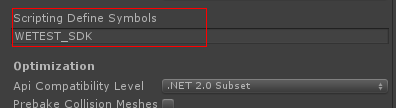

GAutomator is no across test automation,so tested game needs to integrate sdk.GAutomator only support android.IOS does not affect complication,but invaild. GAutomator SDK has **NGUI and UGUI versions**, choice the right SDK according your gampe project.
GAutomator SDK [download](https://github.com/Tencent/GAutomator/tree/master/bin) include files:
```bash
libcrashmontior.so
u3dautomation.jar
U3DAutomation.dll
```

**Note:Release Game can not integrated GAutomator SDK.Dangerous!!!**

# How to integrate SDK

**step 1:Import the unity project**
1、U3DAutomation.dll contaions a MonoBehaviour, copy it to the Assets directory.
2、libcrashmonitor.so、u3dautomation.jar is pulg-ins for android, so copy them to the Assets\Plugins\Android directory or Builds\Plugin\Android.

**step 2:Add U3DAutomation Component**
Select the first start scene, create an gameobject, and then add the WeTest.U3DAutomation.U3DAutomationBehaviour monobehaviour to the gameobject
```
public class WeTestManager : MonoBehaviour {

    Application.LogCallback logCall;
	void Start () {
//#if WETEST_SDK 
        this.gameObject.AddComponent<WeTest.U3DAutomation.U3DAutomationBehaviour>();
//#endif
        
    }
}
```
Unity can define preprocessor directives to control integrate GAutomator SDK or not when compiling [Description](https://docs.unity3d.com/Manual/PlatformDependentCompilation.html). 
**Way 1 use unity editor**
Open the Other Settings panel of the Player Settings and navigate to the Scripting Define Symbols text box.


**Way 2 use global custom #defines**
Usually used for continuous integration.smcs.rsp or gmcs.rsp，can add scripting define symbols.for example:
```python
def ModifyMacro(workSpacePath, appName, mode):
    fsmcs = open(workSpacePath + /Assets/smcs.rsp", 'w')
    fgmcs = open(workSpacePath + /Assets/gmcs.rsp", 'w')

    if mode == "debug":
        fsmcs.write("-define:WETEST_SDK")
        fgmcs.write("-define:WETEST_SDK")

```

**step 3:Check integreated sucessfully**
Launch the game which integrated GAutomator SDK,then search the android log
```bash
adb logcat -vthreadtime -s Unity
```
If find `U3DAutomation Init OK`,GAutomator SDK integrated successfully.


# FAQ
1、Integrated Bugly or other crash monitor components
You can register the WeTest.U3DAutomation.CrashMonitor._OnLogCallbackHandler to the callback function of other components. For example, Bugly can use the following code to do compatibility.
```python
public class WeTestManager : MonoBehaviour {

    Application.LogCallback logCall;
	void Start () {
#if WETEST_SDK
        this.gameObject.AddComponent<WeTest.U3DAutomation.U3DAutomationBehaviour>();
        BuglyAgent.RegisterLogCallback(WeTest.U3DAutomation.CrashMonitor._OnLogCallbackHandler);
#endif
        
    }
}
```