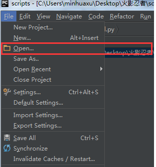
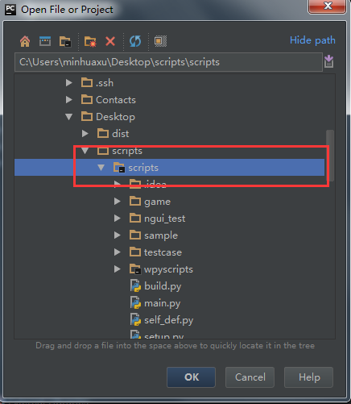
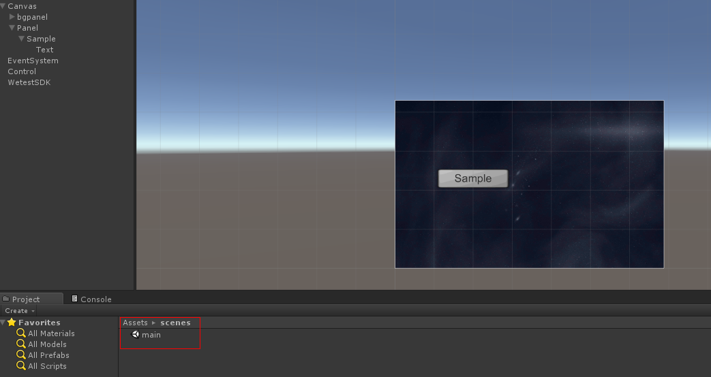
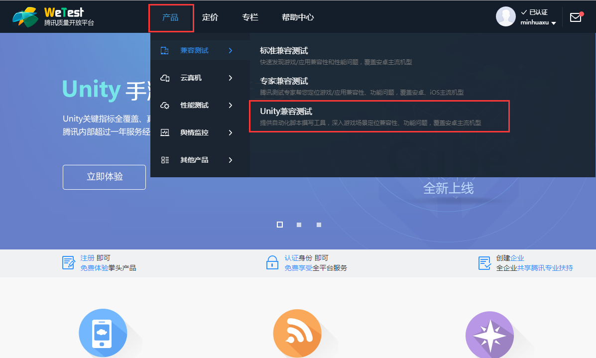
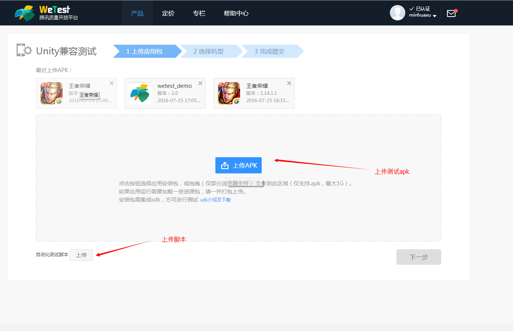
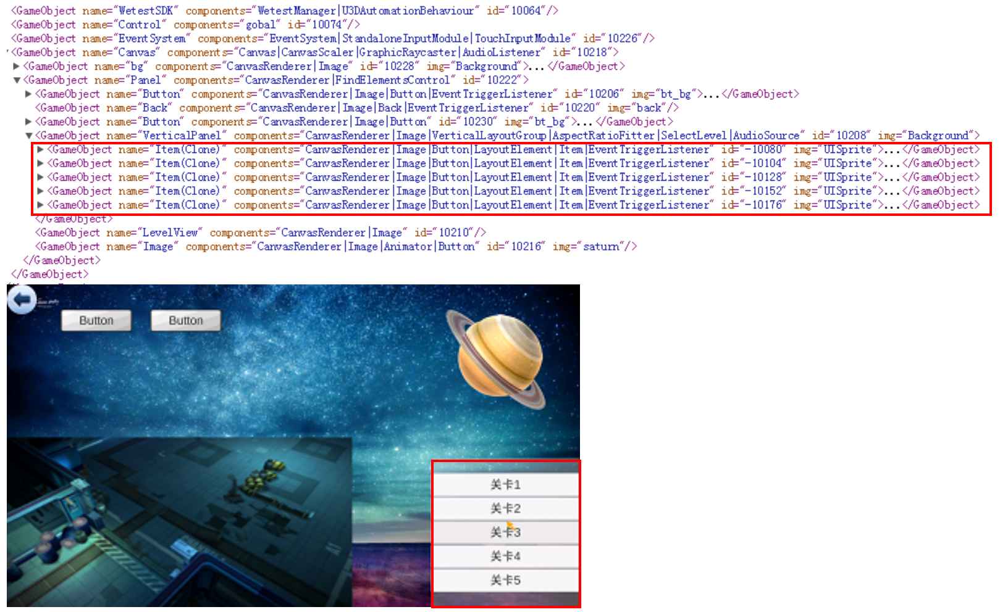
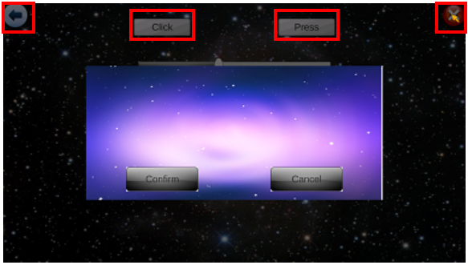
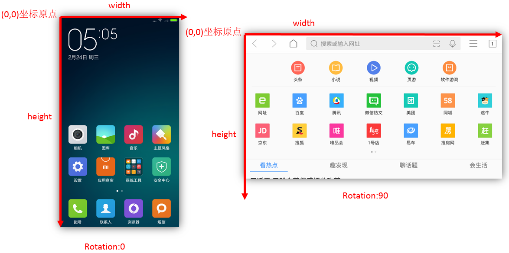
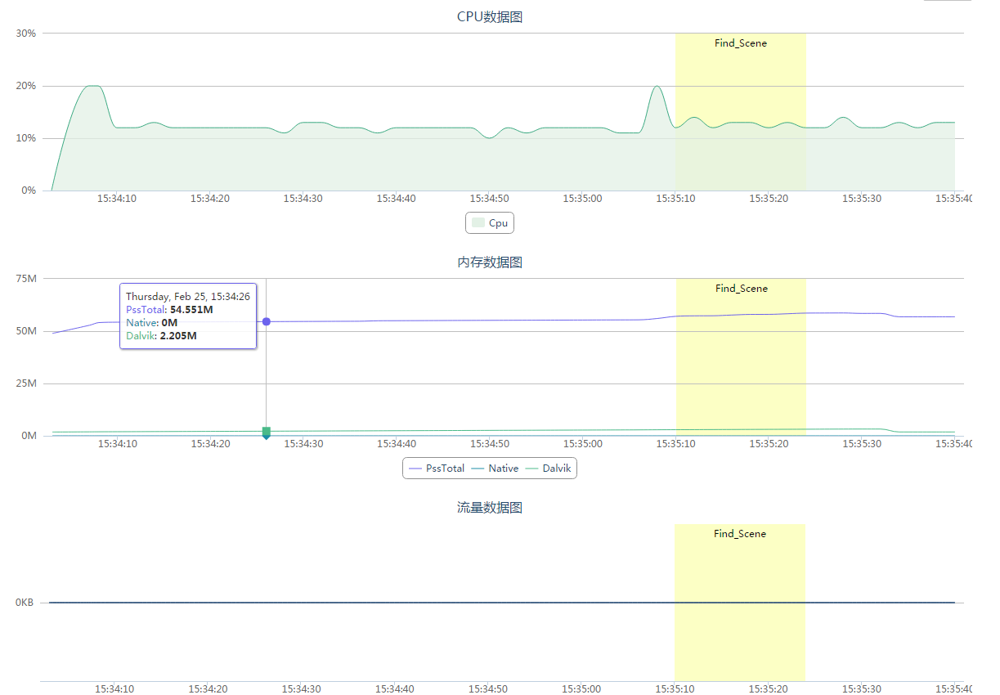

# 1 Introduction
## 1.1 Introduction GAutomator
GAutomator(Game Automator) is an open source test automation framework for Unity game.GAutomator Client use adb connect from your Android device to your host computer(->can use adb to build/estabilish a connection between your Android device and your host computer),then GAutomator can send requests to the SDK via socket, including querying the GameObject, getting UI location information, performing click actions, and so on.You can use GAutomator to do Android compatibility test;functional test,such as PVP game test, Pve game all level smoke test;performance test.


## 1.2 System Requirements
**Windows Os and Software Requirements:**
- Windows 7 (32/64 bit), Windows 8 or higher
- python 2.7
- Android SDK(or adb),Enable ADB setting on device and connect your android device using usb with your PC.


**Linux and Software Requirements:**
- Ubuntu 14.04 LTS
- python 2.7
- Android SDK(or adb),Enable ADB setting on device and connect your android device using usb with your PC.

**Android**:
Android 4.3 (API level 18) or higher.

## 1.3 Quick start
We recommend using pycharm as the IDE.GAutomator can be regarded as a project,pycharm can open it.


You can create test script in the testcase directory, and edit you test.

## 1.4 GAutomator Viewer

GAutomatorViewer can help you inspect the UI of an application in order to find the layout hierarchy, and view the properties associated with the controls.[GAutomatorView](http://cdn.wetest.qq.com/com/c/GAutomatorView.zip),While designing your UI automation suite, this tool is very helpful as it exposes the GameObject name and other attributes of an GameObject, which is needed for writing scripts,[GAutomatorView Documentation](https://github.com/Tencent/GAutomator/blob/master/doc/GAutomatorView%E6%B8%B8%E6%88%8F%E6%8E%A7%E4%BB%B6%E6%9F%A5%E7%9C%8B%E5%99%A8.md "GAutomatorView").


# 2 Getting started
example:sample/sample.py, demo game apk:sample/wetest_demo.apk

## 2.1 Simple Usage
```python

#import lib path,only use in this demo
#import sys,os
#sys.path.append(os.path.abspath(os.path.join(os.getcwd(), "..\\")))

import wpyscripts.manager as manager

def test():
    engine=manager.get_engine()
    logger=manager.get_logger()

    version=engine.get_sdk_version()
    logger.debug("Version Information : {0}".format(version))

    scene=engine.get_scene()
    logger.debug("Scene :   {0}".format(scene))

    sample_button=engine.find_element("/Canvas/Panel/Sample")
    logger.debug("Button : {0}".format(sample_button))
    engine.click(sample_button)

test()

```
save as sample.py,run as:
```bat
python sample.py
```
*Note: Before running the script, make sure the wetest_demo game is launched, the mobile is connected to the computer and the developer option is turned on*

## 2.2 Example Detail
The wpyscripts.manager module provides all the functionality needed for automated testing, providing content related to engine, device, report.
```python
import wpyscripts.manager as manager
```
next,create engine and logger instance.
```python
engine=manager.get_engine()
logger=manager.get_logger()
```
*`engine.get_sdk_version()`*can get Unity version information, Wetest SDK version information, when GAutomator client can get this information.This means the GAutomator client has been successfully connected to the game.
```python
version=engine.get_sdk_version()
logger.debug("Version Information : {0}".format(version))
```

`engine.get_scene()`Get the current game scene name, "main" is the first wetest_demo game scene name.



`engine.find_element("/Canvas/Panel/Sample")`Finds a GameObject by name and returns it.find_element use Unity [GameObject.Find](http://docs.unity3d.com/ScriptReference/GameObject.Find.html?from=index) to find the Unity GameObject.The find sample_button (Element instance) has two field object_name and instance. The field object_name is the full path of gameojbect, the field instance is the instance id of the object(GameObject.GetInstanceId（）method get)， the instance id is always gurantedd to be unique.
`engine.click(sample_button)`try to click the center of Sample Button
```python
sample_button=engine.find_element("/Canvas/Panel/Sample")
logger.debug("Button : {0}".format(sample_button))
engine.click(sample_button)
```

GAutomator has three categories of interfaces:
```python
engine=manager.get_engine()
reporter=manager.get_reporter()
device=manager.get_devcie()
```
- engine: Unity engine related features,such as find gameobject, operate the game.
- reporter: Report related, such as screenshots,mark the operation process.
- device: Mobile phone releated, such as get display size,rotation,login QQ or wechat.


## 2.3 Test on wetest cloud platform
GAutomator tester script can run on your pc and wetest cloud test platform. Wetest prepare a docker container for each mobile, run your script just like on a linux pc has one mobile(prepare python,adb).WeTest cloud test platform will find the compatibility issues, also record the test process, provide screenshot,mobile log,crash information and so on.
When wetest cloud platform executes your test script, it execute the main.py. main.py contain install your application,clear your application data and qq wechat data,launch your application. After prepare the environment, start your test logic from testcase.runner run function.
```python
import traceback

try:
    from sample.sample import *
except Exception,e:
    traceback.print_exc()

def run():
    """
        your test logic
    """
    try:
        test()
    except Exception,e:
        traceback.print_exc()
```
then run build.py,this script will generate a script zip run on the wetest platform.
```python build.py```

start test step:





## 2.4 Test on local PC
**Note:When debug your test script(such as login function), you need to launch your application and go to the scene you want to test. For example, if you want to debug your buy test script, go to the game hall, and start to run your script**
GAutomator can test multiple mobile on a PC.First you need to set the game package name, at the beginning of main.py,just like
```python
local_package = os.environ.get("PKGNAME", "")  # Your tested game package name,such as com.tencent.tmgp.sgame

#local_package ="com.tencent.wetest.demo"
```
1、run test script, when pc connect one mobile.
```bat
python main.py
```
In fact, we use the default qq or wechat account(set in main.py)，engineport(53001),uiautomator forward port(19008)

2、run test script, when pc connect multiple mobiles
```bat
adb devices #list all the connected devices

saaaweadf        device
asdfadfadf		 device

```
After obtaining the serial number of the mobile phone connected to your PC, you can run your test script by command. You need to set the argument for each mobile phone,such as:
```bat
python main.py --qqname=2952020110 --qqpwd=wetestpwd --engineport=50031 --uiport=19000 --serial=saaaweadf
python main.py --qqname=2952020111 --qqpwd=wetestpwd --engineport=50032 --uiport=19001 --serial=asdfadfadf
```
**serial** is the serial number of mobile phone,such as saaaweadf. **qqname** is the qq account, **qqpwd** is the qq account password. **engineport** is the local socket port forward to the GAutomator SDK listen socket port on mobile. **uiport** is the local socket port forward to the xiaocong uiautomator server listen port on mobile.**serial** the serial number of device

**arguments**:
```bat
--qqname:QQ account, each mobile phone must unique
--qqpwd:QQ account password
--wechataccount:Wechat account, each mobile phone must unique
--wechatpwd:Wechat account password
--othername:Other account
--otherpwd:Other account password
--engineport:the local socket port forward to the GAutomator SDK listen socket port on mobile
--uiport:the local socket port forward to the xiaocong uiautomator server listen port on mobile
--serial:adb devcies obtain,the serial number of device
```

# 3 Locating Elements
GAutomator has three way to find the GameObject。Example：sample/find_elements.py
- *find_element*
- *find_elements_path*
- *find_elements_by_component*

## 3.1 find_element
*find_element* use the [GameObject.Find] method to find a GameObject by name.This function only returns active GameObjects. If no GameObject with name can be found, null is returned. If name contains a '/' character, it traverses the hierarchy like a path name. *We find a bug in same unity version, when you use the full path, it may return the inactive gameobject*
```python
#import sys,os,time
#sys.path.append(os.path.abspath(os.path.join(os.getcwd(), "..\\")))

import wpyscripts.manager as manager
def test_find_element():
    button=engine.find_element("/Canvas/Panel/Button")
    bound=engine.get_element_bound(button)
    logger.debug("Button : {0},Bound : {1}".format(button,bound))
    engine.click(button)

    button=engine.find_element("Button")
    bound=engine.get_element_bound(button)
    logger.debug("Button : {0},Bound : {1}".format(button,bound))
    engine.click(button)

    button=engine.find_element("Panel/Button")
    bound=engine.get_element_bound(button)
    logger.debug("Button : {0},Bound : {1}".format(button,bound))
    engine.click(button)

    unexited_gameobj=engine.find_element("Test")
    if unexited_gameobj is None:
        logger.debug("Test GameObject not find")

test_find_element()
```
Save as find_elements.py, launch wetest_demo application, then run your test script

```bat
python find_elments.py
```


```xml
<GameObject name="WetestSDK" components="U3DAutomationBehaviour" id="10064" />
<GameObject name="Control" components="gobal" id="10074" />
<GameObject name="EventSystem" components="EventSystem|StandaloneInputModule|TouchInputModule" id="10196" />
<GameObject name="Canvas" components="Canvas|CanvasScaler|GraphicRaycaster|AudioListener" id="10188">
  <GameObject name="bg" components="CanvasRenderer|Image" id="10198" img="Background">
    <GameObject name="RawImage" components="CanvasRenderer|RawImage" id="10194" img="find_bg" />
  </GameObject>
  <GameObject name="Panel" components="CanvasRenderer|FindElementsControl" id="10192">
    <GameObject name="Button" components="CanvasRenderer|Image|Button|EventTriggerListener" id="10182" img="bt_bg">
      <GameObject name="Text" components="CanvasRenderer|Text" id="10186" txt="Button" />
    </GameObject>
    <GameObject name="Back" components="CanvasRenderer|Image|Back|EventTriggerListener" id="10190" img="back" />
    <GameObject name="Button" components="CanvasRenderer|Image|Button" id="10200" img="bt_bg">
      <GameObject name="Text" components="CanvasRenderer|Text" id="10184" txt="Button" />
    </GameObject>
  </GameObject>
</GameObject>
```
This scene has two gameobjects("/Canvas/Panel/Button"), this function can only return one gameobject. If the name you find is not existed in this scene, return None.

## 3.2 find_elements_path
*find_elements_path* can find gameobjects by name,path,text or image name。But *find_elements_path* is a very time-consuming operation that requires careful use，has a certain impact on the performance of test data。*find_elements_path*： through the expression to find gameobjects, support find conditions:
- gameobject path
- gameobject index
- gameobject which contain a image component, according the image name
- gameobject which contain a text component, according the text content
***Note: The order of the results is not unique***


### 3.2.1 Find GameObject by path
```python
def test_find_elements_by_name():
    elements = engine.find_elements_path("/Canvas/Panel/VerticalPanel/Item(Clone)")
    for element in elements:
        bound=engine.get_element_bound(element)
        logger.debug("Button : {0},Bound : {1}".format(element,bound))
        engine.click(bound)
        time.sleep(0.5)
test_find_elements_by_name()
```
save as find_elments.py,launch wetest_demo and click "FindElements" button，go to the "FindElements" scene, then run test script:

```bat
python find_elments.py
```
*find_elements_path* return all matching gameobjects



return results:
```xml
GameObject /Canvas/Panel/VerticalPanel/Item(Clone) Instance = -10080
GameObject /Canvas/Panel/VerticalPanel/Item(Clone) Instance = -10104
GameObject /Canvas/Panel/VerticalPanel/Item(Clone) Instance = -10128
GameObject /Canvas/Panel/VerticalPanel/Item(Clone) Instance = -10152
GameObject /Canvas/Panel/VerticalPanel/Item(Clone) Instance = -10176
```
the list of "关卡" Button gameobjects，can find by */Canvas/Panel/VerticalPanel/Item(Clone)*. It can find gameobjects by other expressions,such as:
```python
_elements = engine.find_elements_path("Panel/VerticalPanel/Item(Clone)")
_elements = engine.find_elements_path("VerticalPanel/Item(Clone)")
_elements = engine.find_elements_path("Item(Clone)")
_elements = engine.find_elements_path("/Canvas/Panel/*/Item(Clone)")
```
- `Panel/VerticalPanel/Item(Clone)`，find the gameobjects which name is Item(Clone), and the parent gameobject is VerticalPanel, and the grandfather is Panel.
- `VerticalPanel/Item(Clone)`，find the gameobjects which name is Item(Clone)，and the parent gameobjec  is VerticalPanel
- `Item(Clone)`，find all the gameobjects which name is Item(Clone)
- `/Canvas/Panel/*/Item(Clone)`，find the gameobjects which name is Item(Clone)，any name of parent gameobjct，grandfather gameobject is Panel, great-grandfather gameobject is Canvas, Canvas is also the root gameobject。* means any name of gameobject.

***find_elments_path*** function is very time consuming.


### 3.2.2 find gameobject by index
If you only want to select the "关卡2" gameobject. You can use *find_elements_path* find gameobjects by index。Find gameobject by index, expression as [num],num start from 0.
```python
def test_find_elements_by_index():
    elements = engine.find_elements_path("/Canvas/Panel/VerticalPanel/*[1]")
    for element in elements:
        bound=engine.get_element_bound(element)
        logger.debug("Button : {0},Bound : {1}".format(element,bound))
        engine.click(bound)
        time.sleep(0.5)

    elements=engine.find_elements_path("/Canvas/Panel/VerticalPanel/Button[0]")
    assert elements == []
test_find_elements_by_index()
```
save as find_elments.py,launch wetest_demo and click "FindElements" button，go to the "FindElements" scene, then run test script:

```bat
python find_elments.py
```
*find_elements_path* in above test script only return the gameobject of index 2
- /Canvas/Panel/VerticalPanel/*[1]，find the second child gameobject of VericalPanel,VericalPanel's parent is Panel,Panel's parent is Cavnvas，Canvas is also the root gameobject.
- /Canvas/Panel/VerticalPanel/Button[0]，find the first child gameobject of VericalPanel which name is Button,VericalPanel's parent is Panel,Panel's parent is Cavnvas，Canvas is also the root gameobject.
**Note: The index start from 0**。[] means the index of child gameobject, so root gameobject can't use [].

### 3.2.3 find gameobjects by image name
*find_elements_path* can find gameobjects by the component's image name.Expression is {img=imageName}，img is the name of image.
```python
def test_find_elements_by_img():
    elements = engine.find_elements_path("/Canvas/Panel/Image{img=saturn}")
    for element in elements:
        bound=engine.get_element_bound(element)
        logger.debug("Button : {0},Bound : {1}".format(element,bound))
        engine.click(bound)
        time.sleep(0.5)
    engine.click_position(100,200)
    elements = engine.find_elements_path("/Canvas/Panel{img=saturn}")
    for element in elements:
        bound=engine.get_element_bound(element)
        logger.debug("Button : {0},Bound : {1}".format(element,bound))
test_find_elements_by_img()
```
save as find_elments.py,launch wetest_demo and click "FindElements" button，go to the "FindElements" scene, then run test script:

```bat
python find_elments.py
```


results:，*/Canvas/Panel/Image{img=saturn}* or */Canvas/Panel{img=saturn}* find the gameobjects.
```xml
Button : GameObject /Canvas/Panel/Image Instance = 10218,Bound : point(1461.0,81.0) width = 352.0 height = 341.0
Button : GameObject /Canvas/Panel Instance = 10222,Bound : point(0.0,0.0) width = 1920.0 height = 1080.5
```
- `/Canvas/Panel/Image{img=saturn}`,find the gameobject which name is Image, and the gameobject or gameobject's children gameobject has image which name is saturn.The gameobjects's parent is Panel, and Panel's parent is Cavnvas，Canvas is also the root gameobject.
- `/Canvas/Panel{img=saturn}`,find the gameobject which name is Panel, and the gameobject or gameobject's children gameobject has image which name is saturn.The gameobjects's parent is Cavnvas，Canvas is also the root gameobject.

img is the name of image，in Unity which components have image
- UGUI,will try to compare Image、RawImage、SpriteRender component's image name
- NGUI，will try to compare UISprite、UITexture、Renderer component's image name

### 3.2.3 find gameobjects by text content
*find_elements_path* can find gameobjects by the component's text content. Expression is {txt=txtName}，txtName is the text content.
```python
def test_find_elements_by_txt():
    elements=engine.find_elements_path("Panel/VerticalPanel/Item(Clone){txt=关卡2}")
    for element in elements:
        bound=engine.get_element_bound(element)
        logger.debug("Button : {0},Bound : {1}".format(element,bound))
        engine.click(bound)
        time.sleep(0.5)

    elements=engine.find_elements_path("Panel/VerticalPanel/Item(Clone){txt=关卡4}")
    if len(elements) > 0:
        engine.click(elements[0])
test_find_elements_by_txt()
```
save as find_elments.py,launch wetest_demo and click "FindElements" button，go to the "FindElements" scene, then run test script:

```bat
python find_elments.py
```


results，*Item(Clone){txt=关卡2}* or *Panel/VerticalPanel/Item(Clone){txt=关卡4}* can also find the gameobject.
```xml
Button : GameObject /Canvas/Panel/VerticalPanel/Item(Clone) Instance = -11784,Bound : point(1420.0,710.5) width = 500.0 height = 80.0
Button : GameObject /Canvas/Panel/VerticalPanel/Item(Clone) Instance = -11832,Bound : point(1420.0,870.5) width = 500.0 height = 80.0
```
- `Panel/VerticalPanel/Item(Clone){txt=关卡2}`,find the gameobject which name is Item(Clone), and the gameobject or gameobject's children gameobject has text component which text content is "关卡2".The gameobjects's parent is VerticalPanel, and VerticalPanel's parent is Panel.
- `Panel/VerticalPanel/Item(Clone){txt=关卡4}`,find the gameobject which name is Item(Clone), and the gameobject or gameobject's children gameobject has text component which text content is "关卡4".The gameobjects's parent is VerticalPanel, and VerticalPanel's parent is Panel.

"txt" is the content of component, in Unity which components have text content.
- UGUI，will try to compare Text、GUIText compontent's content
- NGUI，will try to compare UILabel、UIInput and GUIText component's content

## 3.3 find gameobject by component name
Find a list of all active loaded gameobjects which have the component. In fact, GAutomator use the unity function  
GameObject.FindObjectsOfType(Type.GetType(name)) to find the gameobjects. In C# Type.getName get the type by the assembly-qualified name. So the example's component name is "UnityEngine.UI.Button,UnityEngine.UI, Version=1.0.0.0, Culture=neutral, PublicKeyToken=null". If you use "Button" as the component's name, the result is None.
```python
def test_find_elements_by_component():
    elements=engine.find_elements_by_component("UnityEngine.UI.Button,UnityEngine.UI, Version=1.0.0.0, Culture=neutral, PublicKeyToken=null")
    for element in elements:
        bound = engine.get_element_bound(element)
        logger.debug("Button : {0},Bound : {1}".format(element, bound))
        engine.click(bound)
        time.sleep(0.5)

test_find_elements_by_component()
```

## 3.4 get gameobject position and bound

### 3.4.1 get gameobject screen position and bound
*engine.get_element_bound(element)* can get the top lefe position of gameobject in the mobile screen, and the gameobject bound.
```python
def test_click():
    #click the button
    element=engine.find_element("/Canvas/Panel/Click")
    bound=engine.get_element_bound(element)
    logger.debug("Button : {0},Bound : {1}".format(element,bound))

    engine.click(bound)
    time.sleep(1)
    engine.click(element)

    time.sleep(2)
    engine.click_position(600.0,100.0)

test_click()
```
```
Button : GameObject /Canvas/Panel/Click Instance = 10652,Bound : point(535.0,60.0) width = 250.0 height = 80.0
```
`engine.get_element_bound(Element)` get the instance of ElementBound，the field x,y is the lef top position of gameobject in the mobile screen.


### 3.4.2 get gameobject position in the world
3D mobile game is more and more popluar, for 3D game such as king of glory, only screen coordinates can not meet the automated test.  In the automate test, we need know the position of self hero,enemy heros, so we can test such move,find enemy,attack.**example:sample/joystick_tester.py test_world_bounds()**
```python
def test_world_bounds():
    person=engine.find_element("/3rd Person Controller/Bip001/Bip001 Pelvis")
    world_bound=engine.get_element_world_bound(person)
    logger.debug(world_bound[0])

test_world_bounds()
```
save as joystick_tester.py,launch wetest_demo and click "Joystick" button，go to the "Joystick" scene, then run test script:
```bat
python joystick_tester.py
```
result：
```xml
center = (5.03773808305e-05,0.1374322474,0.00151373702101) extents =(0.0807622969151,0.09486310184,0.0181320905685)
```
Get the array of WorldBound which is the world space postion and bound of gameobjects. WorldBound used to store the position,bound.The center field is the center of the gameobject in the world space, the extents field is the extents of the gameobject box, this is always half of the size.Description:[http://docs.unity3d.com/ScriptReference/Bounds.html](http://docs.unity3d.com/ScriptReference/Bounds.html)

# 4 Interaction
After find the gameobject and know the position of gameobject in the screen, you need the click the gameobject. Code example：sample/interaction.py
```python
engine.click(button)
```
Interaction operation function according the screen space, send touch event to the application.



## 4.1 Click
*engine.click()* accept the instance of element or elementbound. If the parameter is the instance of element, get the elementbound by engine.get_element_bound, then according the position and bound get the center of gameobject, send touch down and up event to the application.
```python
def test_click():
    #click
    element=engine.find_element("/Canvas/Panel/Click")
    bound=engine.get_element_bound(element)
    logger.debug("Button : {0},Bound : {1}".format(element,bound))

    engine.click(bound)
    time.sleep(1)
    engine.click(element)

    time.sleep(2)
    engine.click_position(600.0,100.0)

test_click()
```
save as interaction.py,launch wetest_demo and click "Interaction" button，go to the "Interaction" scene, then run test script:

```bat
python interaction.py
```
Autotest script will click three times,

- `engine.click(bound)`click the center of gameobject (point.x+withd/2,point.y+height/2)
- `engine.click(element)`get the elementbound of gameobject,then click the center of gameobject
- `engine.click_position(600.0,100.0)`click the coordinate (600.0,100.0)

## 4.2 long press
*engine.press() and engine.press_position* is similar to click function, more than a time parameter, indicating long press time (ms, milliseconds)
```python
def test_press():
    element=engine.find_element("/Canvas/Panel/Press")
    engine.press(element,5000)
    time.sleep(2)
    engine.press_position(1200,100,3000)
    
test_press()
```
save as interaction.py,launch wetest_demo and click "Interaction" button，go to the "Interaction" scene, then run test script:

```bat
python interaction.py
```

- `engine.press(element,5000)`,`/Canvas/Panel/Press` long press the element 5 second
- `ngine.press_position(1200,100,3000)`,long press coordinate (1200,100) 3 second


## 4.3 swipe
*engine.swipe(start_element, end_element, steps=20, duration=1000) and engine.swipe_position(start_x,start_y,end_x,end_y,steps=20, duration=1000)*，perform a swipe from one element to another, or swipe from one coordinate to anthoer coordinate. duration can control the swipe time, and steps can control the smoothness and speed of swipe by specifying the number of steps.(more steps more performance impact)
```python
def test_swipe():
    start_e=engine.find_element("/Canvas/Panel/Press")
    end_e=engine.find_element("/Canvas/Panel/Click")
    engine.swipe(start_e,end_e,50,2000)

    silder=engine.find_element("/Canvas/Panel/Slider")
    if silder:
        bound=engine.get_element_bound(silder)
        engine.swipe_position(bound.x,bound.y+bound.height/2.0,bound.x+bound.width,bound.y+bound.height/2,100,3000)
test_swipe()
```
save as interaction.py,launch wetest_demo and click "Interaction" button，go to the "Interaction" scene, then run test script:

```bat
python interaction.py
```
start from the center of "Press" button to the center of "Click" button, so for a 50 steps, take around 2000ms to complete.
```
start_e=engine.find_element("/Canvas/Panel/Press")
end_e=engine.find_element("/Canvas/Panel/Click")
engine.swipe(start_e,end_e,50,2000)
```
swipe from (bound.x,bound.y+bound.height/2.0) to (bound.x+bound.width,bound.y+bound.height/2), so for a 100 steps, take around 3000ms to complete.
```
silder=engine.find_element("/Canvas/Panel/Slider")
if silder:
   bound=engine.get_element_bound(silder)
   engine.swipe_position(bound.x,bound.y+bound.height/2.0,bound.x+bound.width,bound.y+bound.height/2,100,3000)
```

## 4.4 input set text
*engine.input(Element,txt)* sets the text in an editable field,after clearing the field's content.
```python
def test_input():
    element=engine.find_element("/Canvas/Panel/InputField")
    engine.input(element,"Run Wpy")

test_input()
```
save as interaction.py,launch wetest_demo and click "Interaction" button，go to the "Interaction" scene, then run test script:

```bat
python interaction.py
```
After setting the text field from *Hello wpyscripts* change to *Run Wpy*.
The setting gameobject must contain InputField(UGUI) or UIInput(NGUI)

## 4.5 handle popup box(get interactive gameobjects)
All the interaction function just perform touch event to the screen. If you click the button under popup box, the  click event is invaild.As the picture shows:

In game，announcements,warning popup box may appear anywhere anytime, interrup the test.engine.get_touchable_elements() can return the list of interactive gameobjects in current scene.
```python
def test_get_touchable_elements():
    e=engine.find_element("/Canvas/Panel/Close")
    engine.click(e)

    elements=engine.get_touchable_elements()
    for e,pos in elements:
        logger.debug("Button : {0},Bound : {1}".format(e,pos))

    time.sleep(2)
    engine.click_position(elements[0][1]["x"],elements[0][1]["y"])

test_get_touchable_elements()
```
save as interaction.py,launch wetest_demo and click "Interaction" button，go to the "Interaction" scene, then run test script:

```bat
python interaction.py
```
result:
```
Button : GameObject /Canvas/Dialog(Clone)/Sure Instance = 4294957156,Bound : {'y': 733.0, 'x': 660.0}
Button : GameObject /Canvas/Dialog(Clone)/Cancel Instance = 4294957136,Bound : {'y': 733.0, 'x': 1260.0}
```
The method return "Confirm" and "Cancel" button in above picture. The other gamobjects "Back","Click","Press" and "Close" gameobject is button, but they are covered by pop-up box, can't clickable.
*`engine.get_touchable_elements()`* is time-consuming operation, will affect performance.

## 4.6 get text
Reads the text property of the gameobject's component.For NGUI,UILable、UIInput、GUIText component have text property. If the gameobject your selected does not contain above components will throw exception. For UGUI,Text,GUIText component have text property。Example：interaction.py
```python
def test_get_element_txt():
    e=engine.find_element("Click/Text")
    text=engine.get_element_text(e)
    logger.debug("Text = {0}".format(text))
```
save as interaction.py,launch wetest_demo and click "Interaction" button，go to the "Interaction" scene, then run test script:

```bat
python interaction.py
```

This script get the "Click" button gameobject's text context "Click".

## 4.7 get image name
Reads the image property of the gameobject's component.For NGUI,UITexture、UISprite、SpriteRenderer component have image name property. For UGUI,Image、RawImage、SpriteRenderer component have image name property.If the gameobject your selected does not contain above components will throw exception.Example：interaction.py
```python
def test_get_element_image():
    e = engine.find_element("Back")
    image = engine.get_element_image(e)
    logger.debug("Image = {0}".format(image))
```
save as interaction.py,launch wetest_demo and click "Interaction" button，go to the "Interaction" scene, then run test script:
```bat
python interaction.py
```
This script get the "Back" button gameobject's image name "back".

# 5 Device
*engine.get_device()* get the instance of Device. Device provides access to state information about the device. You can also use this class to simulate user actions on the device, such as pressing Back. Example：sample/devices_tester.py

## 5.1 Display size and rotation

```python
def test_get_display_size():
    display_size=device.get_display_size()
    logger.debug(display_size)

    rotation=device.get_rotation()
    logger.debug("Rotation : {0}".format(rotation))

test_get_display_size()

```
*get_display_size* get the width and height of the display in pixels. *get_rotation* get the rotation of display, as define in [Surface](https://developer.android.com/reference/android/view/Surface.html) 



<a name="5.2"></a>

## 5.2 get top package and Activity
```python
def test_get_top_package_activity():
    top_activity=device.get_top_package_activity()
    logger.debug(top_activity)

test_get_top_package_activity()

```
save as devices_tester.py, run test script anytime:

```bat
python devices_tester.py
```
*device.get_top_package_activity()* get current top application's package name and activtiy
```
package name = com.tencent.wetest.demo,activity = com.unity3d.player.UnityPlayerActivity
```

## 5.3 press back
Simulates a short press on the BACK button.

```python
def test_back():
    device.back()
test_back()
```
save as devices_tester.py, run test script anytime:

```bat
python devices_tester.py
```


# 6 Cloud platform reporter
*engine.get_reporter()* get the instance of Reporter. Reporter provides features such as screenshot,mark,report error. These features can only use on wetest cloud testing platform, in your local pc is useless.
```python
import sys, os, time

#sys.path.append(os.path.abspath(os.path.join(os.getcwd(), "..\\")))

import wpyscripts.manager as manager

engine = manager.get_engine()
logger = manager.get_logger()
reporter = manager.get_reporter()


def screen_shot_click(element):
    logger.debug("screen_shot_click")
    if element is None:
        return
    bound = engine.get_element_bound(element)
    logger.debug(bound)
    pos_x = bound.x + bound.width / 2
    pos_y = bound.y + bound.height / 2
    reporter.capture_and_mark(pos_x, pos_y, locator_name = element.object_name)
    engine.click_position(pos_x, pos_y)


def enter_find_elmeents():
    find_elements_button = engine.find_element("/Canvas/Panel/FindElements")
    logger.debug(find_elements_button)
    screen_shot_click(find_elements_button)
    time.sleep(1)

def back_main():
    find_elements_button = engine.find_element("/Canvas/Panel/Back")
    logger.debug(find_elements_button)
    screen_shot_click(find_elements_button)
    time.sleep(1)

def test_capture_and_mark():
    elements = engine.find_elements_path("/Canvas/Panel/VerticalPanel/Item(Clone)")
    for element in elements:
        screen_shot_click(element)
        time.sleep(2)

def test_reporter():
    print("test_reporter")
    enter_find_elmeents()
    time.sleep(2)
    reporter.add_start_scene_tag("Find_Scene")
    test_capture_and_mark()
    reporter.add_end_scene_tag("Find_Scene")
    time.sleep(2)
    back_main()
	reporter.screenshot()

```

set the *test_reporter()* function in runner.py.Updateload the test script to wetest cloud testing platform, the test script can run on multi mobile phones
```python
import traceback

try:
    from sample.reporter_tester import *
except Exception,e:
    traceback.print_exc()

def run():
    """
        test logic entry function
    """
    try:
        test_reporter()
    except Exception,e:
        traceback.print_exc()
        stack=traceback.format_exc()
        logger.debug(stack)
```




<a name="6.1"></a>

## 6.1 screen shot and mark
```python
def screen_shot_click(element):
    logger.debug("screen_shot_click")
    if element is None:
        return
    bound = engine.get_element_bound(element)
    logger.debug(bound)
    pos_x = bound.x + bound.width / 2
    pos_y = bound.y + bound.height / 2
    reporter.capture_and_mark(pos_x, pos_y, locator_name = element.object_name)
    engine.click_position(pos_x, pos_y)
```
*reporter.capture_and_mark(pos_x, pos_y, locator_name = element.object_name)* take a screenshot of current window and make a red circle on the position pos_x pos_y， the picture will show in the reporter.


<a name="6.2"></a>

## 6.2 screen shot
*reporter.screenshot()*take a screenshot of current window，on wetest cloud testing platform show in the reporter, on local pc save it to screen directory.

## 6.3 report error
GAutomator does not use the unittest as the underlying framework for testing, so there is no assertion that functional testing can not be done. report_error function can save the error information into _wetest_testcase_result.txt. Wetest cloud testing platform can also pares the error information and show in the reporter.

```python
report.report_error("testcase","content")
report.report_error(u"report_test",u"Report test error 中文")
```

*reporter.report_error(name,message)* In the process of interface call, it will be output in the log. At the end of the run of the script, runner.run calls _report_total () to output all the results to _wetest_testcase_result.txt. The GAutomator adds the call stack in addition to the output message and test_case_name. The name of the name is not repeated as much as possible. Name and message incoming encoding needs to be consistent, if there is a Chinese case must use UTF-8 encoding format.


# 7 Custom function
GAutomator can not integrate all the features, some features are not complete through a simple touch screen operation. Custom function, can use C# script in the game to finish self define function, and send to result to python client.
This feature requires game developers and game testers to work together
1. in game registered custom function
2. automatic script, call the custom function

## 7.1 Register function in unity 
Unity game developers need to register the corresponding function to GAutomator SDK for script calls, such as the completion of hero displacement
```C#
using UnityEngine;
using System.Collections;
using WeTest.U3DAutomation;

public class CustomTester : MonoBehaviour {
	void Start () {

        Debug.Log("Register test");
        WeTest.U3DAutomation.CustomHandler.RegisterCallBack("test", testReq);
	}

    string testReq(string args)
    {
        Debug.Log("Args = " + args);
        string result = args + " Response";
        return result;
    }

    void OnDestroy()
    {
        Debug.Log("UnRegister test");
        CustomHandler.UnRegisterCallBack("test");
    }
}

```
*WeTest.U3DAutomation.CustomHandler.RegisterCallBack("test", testReq)*: register a callback to GAutomator SDK, you need to specifiy the callback name and the callback function. After registering the callback, you can call the function according the registered callback name. All of the callback function's argument is a string, and return value is also a string value.
*CustomHandler.UnRegisterCallBack("test")*:remove a callback, according the callback name.

## 7.2 Call registered callback
GAutomator can call the game process's registered callback function remotely, and get the return value. **example: sample/self_define_fun.py**

### 7.2.1 get list of registered callbacks
*engine.get_registered_handlers()* gets the list of registered callback names
```python
def test_get_registered_handlers():
    result = engine.get_registered_handlers()

    for name in result:
        logger.debug(name)

test_get_registered_handlers()
```
save as self_define_fun.py, and launch wetest_demo application:
```bat
python self_define_fun.py
```
running the test script, it will get the result "test".

### 7.2.2 call registerd callback function
*engine.call_registered_handler("test", "python call test")*: calls the registered callback function, according the registerd callback name, and pass the string parameters, get the string value return from the application process.
```python
def test_call_registered_handler():
    result = engine.call_registered_handler("test", "python call test")
    logger.debug(result)

test_call_registered_handler()

```
save as self_define_fun.py, and launch wetest_demo application:
```bat
python self_define_fun.py
```
Call the "test" callback function, pass parameter "python call test", and return the value "python call test Response". "test" callback function's return value is parameter+"Response".


### 7.2.3 get all the public methods
Returns all the public methods of the gameobject's special component. Return method contain function name,parameters,return value.In wetest_demo, "Sample" gameobject has a component ReflectionTest, we can get all the public methods.
```python
def test_get_component_methods(self):
    element = self.engine.find_element("Sample")
    methods = self.engine.get_component_methods(element, "ReflectionTest")
    logger.debug(methods)
```
save as sample/interaction.py, launch wetest_demo application, and run the script. It can print all the pubic methods.

### 7.2.4 invoke method
Invoke the specified gameobject's specified component's public method, using the specified parameters.In wetest_demo, "Sample" gameobject has a component ReflectionTest, we can invoke the "TestReflection" method which has two integer parameters and one string parameter.example:
```python
def test_call_component_method(self):
    element = self.engine.find_element("Sample")
    params = []
    params.append(5)
    params.append("Hello World")
    result = self.engine.call_component_method(element, "ReflectionTest", "TestReflection", params)
    logger.debug(result)
```
the test script will print "105", ReflectionTest.TestReflection return value.

### 7.3 get property value
Returns the property value of a specified gameobject's specified component. GAutomator will call toString method convert the value to string.
```python
def test_get_component_field(self):
        elements = self.engine.find_elements_path("Sample/Text")
        self._start()
        res = self.engine.get_component_field(elements[0], "Text", "text")
        self._end("get_component_field")
        self.assertEqual(res, "Sample")

        e = self.engine.find_element("Panel")
        res = self.engine.get_component_field(e, "MainControl", "bollon")
        self.assertEqual(res, "Bollon (UnityEngine.RectTransform)")
```
save as sample/interaction.py, launch wetest_demo application, and run the script. It can print the text value of the "Sample/Text" gameobject's MainControl component

### 7.4 setting render camera
In Unity, an gameobject may be rendered by multi cameras at the same time. GAutomator will try to find the best camera, but sometimes may find the camera is not correct.Specifically, the rendering of the object size and location is not accurate, may be much larger than the actual length and width. GAutomatorView can show gameobject bound and position. If you find gameobject's bound or position is not right, you can set camera, and use GAutomatorView to check.engine.*set_camera(gameobject_name)*： set the camera's gameobject name
```C#
engine.set_camera("CharModeCamera")

```
If you set camera, GAutomator will use the camera you setting to compute the bound and position.[UnityCamera Description](https://docs.unity3d.com/ScriptReference/Camera.html "UnityCamer资料")