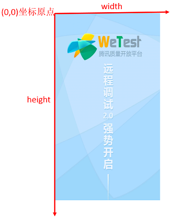
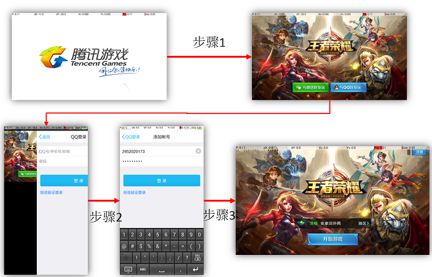
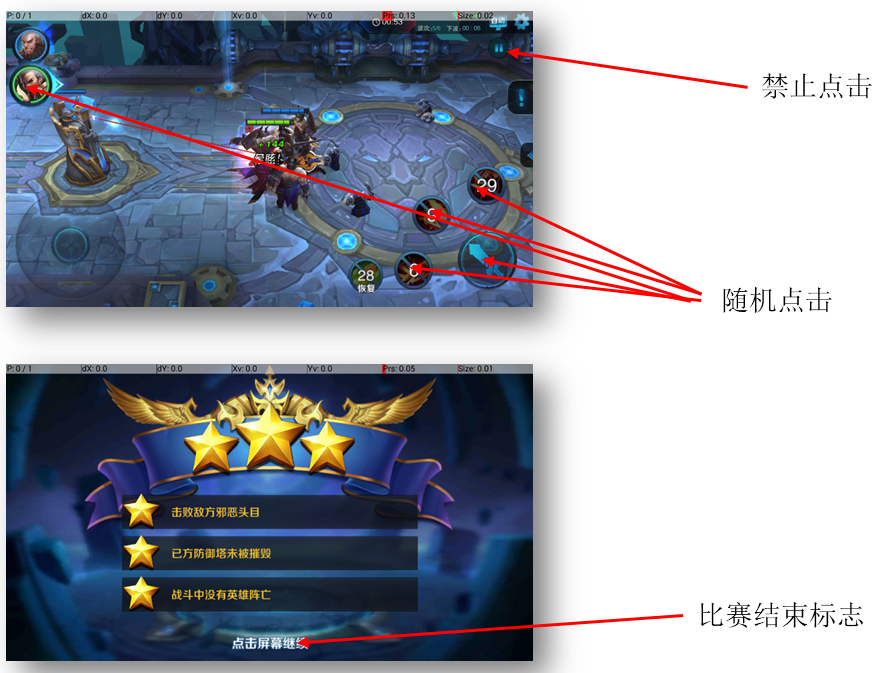

<a name="GAutomatorAndroid"></a>

## GAutomatorAndroid Unity自动化测试教程 ##
- [1 准备工作](#1)
	- [1.1 介绍](#1.1)
	- [1.2 环境](#1.2)
	- [1.3 使用脚本](#1.3)
	- [1.4 GAutomatorView](#1.4)
- [2 Getting](#2)
	- [2.1 Simple](#2.1)
	- [2.2 实例详解](#2.2)
	- [2.3 wetest云端兼容测试](#2.3)
	- [2.4 本地运行](#2.4)
- [3 Locating](#3)
	- [3.1 find_element](#3.1)
	- [3.2 find_elements_path](#3.2)
		- [3.2.1 名称查找](#3.2.1)
		- [3.2.2 子节点序列查找](#3.2.2)
		- [3.2.3 节点中的图片名称查找](#3.2.3)
		- [3.2.3 节点中的文字查找](#3.2.3)
	- [3.3 component名称查找](#3.3)
	- [3.4 节点位置查找](#3.4)
		- [3.4.1 节点在屏幕上的位置](#3.4.1)
		- [3.4.2 世界坐标获取](#3.4.2)
- [4 交互](#4)
	- [4.1 点击操作](#4.1)
	- [4.2 long](#4.2)
	- [4.3 swipe滑动](#4.3)
	- [4.4 input输入](#4.4)
	- [4.5 弹出框处理(获取可交互节点)](#4.5)
	- [4.6 获取文字内容](#4.6)
	- [4.7 获取图片名称](#4.7)
- [5 Mobile设备](#5)
	- [5.1 屏幕尺寸与转向](#5.1)
	- [5.2 顶层Package与Activity](#5.2)
	- [5.3 回退键](#5.3)
- [6 云端报告](#6)
	- [6.1 截图与操作过程标记](#6.1)
	- [6.2 截图](#6.2)
	- [6.3 打标签](#6.3)
	- [6.4 报告错误](#6.4)
- [7 定制功能](#7)
	- [7.1 Unity游戏端注册委托](#7.1)
	- [7.2 脚本调用](#7.2)
		- [7.2.1 获取可执行委托](#7.2.1)
		- [7.2.2 执行委托](#7.2.2)
		- [7.2.3 获取组件上的方法](#7.2.3)
		- [7.2.4 调用组件上的方法](#7.2.4)
		- [7.3 反射获取游戏中属性值](#7.3)
		- [7.4 设置最佳渲染Camera](#7.4)
	- [7.5 调用第三方C#脚本](#7.5)
	- [7.6 C#脚本调用Python函数](#7.6)
- [8 实战用例](#8)
	- [8.1 摇杆](#8.1)
	- [8.2 记录操作流程](#8.2)
	- [8.3 QQ或微信登录](#8.3)
	- [8.4 战斗场景随机操作](#8.4)
	- [8.5 选区操作](#8.5)
	- [8.6 自动化探索遍历](#8.6)
	- [8.7 异常处理](#8.7)
- [9 实际使用接口](#9)
	- [9.1 screen_shot_click](#9.1)
	- [9.2 screen_shot_click_pos](#9.2)
	- [9.3 find_element_wait查找控件直到出现位置](#9.3)
	- [9.4 wait_for_scene等待某个场景加载完毕](#9.4)


**GAutomator** 通过Python实现Unity手游的UI自动化测试，强烈建议使用pycharm编辑python。可在bin目录下包含所有需要的组件。

<a name="1"></a>

# 1 准备工作
<a name="1.1"></a>

## 1.1 介绍
通过Python实现Unity手游的UI自动化测试。GAutomator测试运行在手机端，通过adb操控手机上的unity手游，支持所有版本的Android手机。这个工具的主要功能包括：测试与Android手机之间的兼容性--测试手游在不同Android手机上的工作情况。功能性测试，PVP游戏可以自动化测试代替人力节省操作，PVE游戏可以自动大关完成冒烟测试。性能测试，云端测试能够手机CPU、内存、流量和FPS数据，能够标记不同的场景。

<a name="1.2"></a>

## 1.2 环境
**1 python**: python 2.7/3.4+

**2 adb**
请确保，你的path环境变量里面设置了adb
在cmd命令行里面输入adb devices，能够看到你的手机序列号

<a name="1.3"></a>

## 1.3 使用脚本
如果使用pycharm的话，直接打开scripts功能即可进行编辑使用


可以在testcase目录下面直接创建你需要的.py脚本，然后编写需要的逻辑

<a name="1.4"></a>

## 1.4 GAutomatorView
GAutomatorView工具可在http://wetest.qq.com/cloud/index.php/phone/blrooike下载 。GAutomator主要根据，Unity游戏中的GameObject的路径名称来编写逻辑。类似于UIAutomator需要有一个，控件查看器；GAutomator也提供了一款类似的，Unity游戏中控件查看器。
**注：请勿将该软件放置在中文目录下**


集成wetest sdk的游戏拉起后，点击同步按钮，就能获取到游戏界面和控件树


<a name="2"></a>

# 2 Getting Started
示例代码：sample/Unity/sample.py,示例apk游戏:https://cdn.wetest.qq.com/com/c/wetest_demo_unity.apk

<a name="2.1"></a>

## 2.1 Simple Usage
已经安装好python及依赖库后，可以使用pycharm（请下社区版，社区版免费）直接打开工程，你可以下面的代码开始我们的测试

```python

#import lib path,only use in this demo
#import sys,os
#sys.path.append(os.path.abspath(os.path.join(os.getcwd(), "..\\")))

import wpyscripts.manager as manager

def test():
    engine=manager.get_engine()
    logger=manager.get_logger()

    version=engine.get_sdk_version()
    logger.debug("Version Information : {0}".format(version))

    scene=engine.get_scene()
    logger.debug("Scene :   {0}".format(scene))

    sample_button=engine.find_element("/Canvas/Panel/Sample")
    logger.debug("Button : {0}".format(sample_button))
    engine.click(sample_button)

test()

```
上面的代码可以保存为sample.py,然后运行
```bat
python samle.py
```
请确保，wetestdemo游戏已经拉起，wpyscripts库能够查找到
	
<a name="2.2"></a>

## 2.2 实例详解
wpyscripts.manager模块提供了自动化测试所需的所有功能，提供与引擎、手机、报告相关的内容，也提供了日志实现
```python
import wpyscripts.manager as manager
```
下一步，创建Engine和日志实例
```python
engine=manager.get_engine()
logger=manager.get_logger()
```
*`engine.get_sdk_version()`*能够获取Unity版本信息、Wetest sdk版本信息，能够获取该信息时，证明脚本已经成功连上游戏。如果获取失败，则会抛出`WeTestNativeEngineDllError`异常,抛出该异常可能是手机USB线没有连好或者手机开发者选项未打开。
*logger.debug("")*输出对应日志，请使用manager.get_logger()获取的实例，避免脚本在云端[wetest.qq.com](http://wetest.qq.com "wetest")使用时出错。
```python
version=engine.get_sdk_version()
logger.debug("Version Information : {0}".format(version))
```

*`engine.get_scene()`*获取当前游戏界面对应scene名称，wetestdemo游戏的第一个界面名称为main


*`engine.find_element("/Canvas/Panel/Sample")`*查找当前界面中路径为/Canvas/Panel/Sample的节点，如果存在则返回Element，不存在则返回None。find_element直接使用Unity [GameObject.Find](http://docs.unity3d.com/ScriptReference/GameObject.Find.html?from=index)查找当前游戏中的game object。
查找到的节点samle_button（*Element*），有两个属性object_name,instance。object_name是节点的全路径，instance是节点实例的编号（GameObject.GetInstanceID()获取）instance在当前游戏中一定是唯一的。
*`engine.click(sample_button)`*尝试点击samle_button这个GameObject的中心点。
```python
sample_button=engine.find_element("/Canvas/Panel/Sample")
logger.debug("Button : {0}".format(sample_button))
engine.click(sample_button)
```

GAutomator包含3大接口
```python
engine=manager.get_engine()
reporter=manager.get_reporter()
device=manager.get_devcie()
```
- engine:Unity相关内容，主要包括控件获取，游戏操作
- reporter:云端报告相关，截图、标记操作过程、性能数据打标签
- device:手机设备相关，如屏幕长宽高、转向，也包括QQ登录等。

<a name="2.3"></a>

## 2.3 wetest云端兼容测试
wpyscripts编写好的测试脚本，只需要非常简单的修改，就能wetest云端上做兼容测试。云端几千台手机，按照脚本执行游戏。wetest能够发现兼容问题，同时高度还原执行现场，包括手机日志、崩溃信息、截图、执行过程等。

云端执行脚本时，会执行testcase.runner下的run函数，只需要把自己的业务逻辑加入到这个函数中即可
```python
import traceback

try:
    from sample.sample import *
except Exception as e:
    traceback.print_exc()

def run():
    """
        业务逻辑的起点
    """
    try:
        test()
    except Exception as e:
        traceback.print_exc()
```
然后，运行scripts目录下的，build.py
```python build.py```
会在scripts目录下产生一个,wpyscripts_upload.zip。只有企业用户才可以使用云端测试，请登录wetest.qq.com，联系工作人员了解详情。


<a name="2.4"></a>

## 2.4 本地运行
**注：调试时手动启动游戏，运行到指定界面，运行对应的脚本即可，如调试大厅界面的代码，游戏跑到大厅界面，再运行自动化测试逻辑。不需要从main.py启动**
GAutomator支持一台PC在多台android手机上同时测试。在config.py文件中，可以配置，完成单台手机测试的情况。
**测试的游戏包名**
```python
class TestInfo(object):
    PACKAGE="com.tencent.wetest.demo" # 测试包名
```
**测试账号**
```python
class Account(object):
    QQNAME="" #QQ账号
    QQPWD="" #QQ密码
    WECHATNAME="" #微信账号
    WECHATPWD="" #微信密码

```
**引擎选择（默认即为Unity)**
unity用户无需进一步选择,**Unity引擎游戏无需再配置**
```
<a name="Engine"></a>

### Engine Type
Unity="unity"
UE4="ue4"

class Engine(object):
    Type=Unity #Type="unity" # unity or ue4
```
一般一个工程通过main方式启动，只能测试一个游戏，所以直接在main.py里面写死，也避免参数传入的麻烦。
1、测试一台手机，如果PC上USB只连接一台手机，直接启动main.py即可(前提配置好测试包名)
```bat
python main.py
```
2、测试多台手机，如果PC上USB连接超过一台手机，需要通过命令行的方式启动
```bat
adb devices #查看当前手机序列号

saaaweadf        device
asdfadfadf		 device

```
获取到当前PC连接的手机序列号之后，通过命令行的方式控制脚本在指定的手机上进行测试。
```bat
python main.py --qqname=2952020110 --qqpwd=wetestpwd --engineport=50031 --uiport=19000 --serial=saaaweadf
python main.py --qqname=2952020111 --qqpwd=wetestpwd --engineport=50032 --uiport=19001 --serial=asdfadfadf
```
上面的命令分别代表，在序列号"saaaweadf"手机上测试，测试时使用的QQ号为2952020110,密码为wetestpwd，与引擎建立映射的网络端口号为50031,与UIAutomator服务建立映射的网络端口为19000。第二条命令类似。

**命令行参数含义**如下：
```bat
--qqname:qq账号，每部手机应该都不一样
--qqpwd:qq密码
--wechataccount:微信账号
--wechatpwd:微信密码
--othername:其他任何账号
--otherpwd:其他任何账号的密码
--engineport:与手机端的sdk服务建立网络映射，填入的为本地的网络端口号（如,50031），不同手机之间要确保不同
--uiport:与手机端的UIAutomator服务建立网络映射，填入的为本地的网络端口号（如,19008），不同手机之间要确保不同
--serial:adb devcies能够查看手机的序列号，不同的序列号代表不同的手机
```

<a name="3"></a>

# 3 Locating Elements
engine模块提供了三种GameObject的查找方式。示例：sample/Unity/find_elements.py
- *find_element*
- *find_elements_path*
- *find_elements_by_component*

<a name="3.1"></a>

## 3.1 find_element
*find_element*通过Unity的GameObject.Find()方法查找游戏中的的gameobject。*find_element*通过GameObject的名称查找对象，名字中可以包含'/'代表GameObject树中的一层。这方法只返回当前激活(active)的gameobject。查找失败时会抛出异常。
当界面上有两个一模一样路径的gameobject时，只返回其中的一个。代码示例：
```python
#import sys,os,time
#sys.path.append(os.path.abspath(os.path.join(os.getcwd(), "..\\")))

import wpyscripts.manager as manager
def test_find_element():
    button=engine.find_element("/Canvas/Panel/Button")
    bound=engine.get_element_bound(button)
    logger.debug("Button : {0},Bound : {1}".format(button,bound))
    engine.click(button)

    button=engine.find_element("Button")
    bound=engine.get_element_bound(button)
    logger.debug("Button : {0},Bound : {1}".format(button,bound))
    engine.click(button)

    button=engine.find_element("Panel/Button")
    bound=engine.get_element_bound(button)
    logger.debug("Button : {0},Bound : {1}".format(button,bound))
    engine.click(button)

    unexited_gameobj=engine.find_element("Test")
    if unexited_gameobj is None:
        logger.debug("Test GameObject not find")

test_find_element()
```
上面的代码可以保存为find_elements.py,从wetestdemo点击FindElements，然后运行

```bat
python find_elements.py
```


```xml
<GameObject name="WetestSDK" components="U3DAutomationBehaviour" id="10064" />
<GameObject name="Control" components="gobal" id="10074" />
<GameObject name="EventSystem" components="EventSystem|StandaloneInputModule|TouchInputModule" id="10196" />
<GameObject name="Canvas" components="Canvas|CanvasScaler|GraphicRaycaster|AudioListener" id="10188">
  <GameObject name="bg" components="CanvasRenderer|Image" id="10198" img="Background">
    <GameObject name="RawImage" components="CanvasRenderer|RawImage" id="10194" img="find_bg" />
  </GameObject>
  <GameObject name="Panel" components="CanvasRenderer|FindElementsControl" id="10192">
    <GameObject name="Button" components="CanvasRenderer|Image|Button|EventTriggerListener" id="10182" img="bt_bg">
      <GameObject name="Text" components="CanvasRenderer|Text" id="10186" txt="Button" />
    </GameObject>
    <GameObject name="Back" components="CanvasRenderer|Image|Back|EventTriggerListener" id="10190" img="back" />
    <GameObject name="Button" components="CanvasRenderer|Image|Button" id="10200" img="bt_bg">
      <GameObject name="Text" components="CanvasRenderer|Text" id="10184" txt="Button" />
    </GameObject>
  </GameObject>
</GameObject>
```
运行时符合"/Canvas/Panel/Button"的节点有两个，但是每次都是节点的第一个。如果查找的节点不存在，则返回None


<a name="3.2"></a>

## 3.2 find_elements_path
*find_elements_path*能够一次查找到多个符合的gameobject。但是*find_elements*是一个**非常耗时的操作需要谨慎使用**，对测试时的性能数据有一定影响（主要是fps值）。*find_elements*通过表达式查找gameobject,查找条件为（查找条件为与，只要出现就一定要满足）：
- gameobject路径
- gameobject在节点中的位置，顺序(第一个节点为0)
- gameobject包含图片组件时的图片名称
- gameobject包含文字组件时的文字内容
***注：不能确保返回结果的顺序***

<a name="3.2.1"></a>

### 3.2.1 名称查找
```python
def test_find_elements_by_name():
    elements = engine.find_elements_path("/Canvas/Panel/VerticalPanel/Item(Clone)")
    for element in elements:
        bound=engine.get_element_bound(element)
        logger.debug("Button : {0},Bound : {1}".format(element,bound))
        engine.click(bound)
        time.sleep(0.5)
test_find_elements_by_name()
```
上面的代码可以保存为find_elements.py,从wetestdemo点击FindElements，然后运行

```bat
python find_elements.py
```
*find_elements_path*能够返回所有符合的节点


返回结果
```xml
GameObject /Canvas/Panel/VerticalPanel/Item(Clone) Instance = -10080
GameObject /Canvas/Panel/VerticalPanel/Item(Clone) Instance = -10104
GameObject /Canvas/Panel/VerticalPanel/Item(Clone) Instance = -10128
GameObject /Canvas/Panel/VerticalPanel/Item(Clone) Instance = -10152
GameObject /Canvas/Panel/VerticalPanel/Item(Clone) Instance = -10176
```
关卡列表，除了*/Canvas/Panel/VerticalPanel/Item(Clone)*符合之外，也可以是其他表达式。
```python
_elements = engine.find_elements_path("Panel/VerticalPanel/Item(Clone)")
_elements = engine.find_elements_path("VerticalPanel/Item(Clone)")
_elements = engine.find_elements_path("Item(Clone)")
_elements = engine.find_elements_path("/Canvas/Panel/*/Item(Clone)")
```
- `Panel/VerticalPanel/Item(Clone)`，表示查找节点Item(Clone)，且父亲节点为VerticalPanel，祖父节点Panel
- `VerticalPanel/Item(Clone)`，表示查找节点Item(Clone)，且父亲节点为VerticalPanel
- `Item(Clone)`，表示查找所有名叫Item(Clone)的节点
- `/Canvas/Panel/*/Item(Clone)`，表示查找节点Item(Clone)，任意父亲节点，祖父节点为Panel,曾祖父节点为Canvas且为根节点。其中*表示任意名称。

***find_elements_path***接口非常耗时。

<a name="3.2.2"></a>

### 3.2.2 子节点序列查找
如果只想选择关卡2，不想返回所有的节点。可以利用*find_elements_path*中的序列来进行查找定位。序列的表达式为[num],num为数字从0开始
```python
def test_find_elements_by_index():
    elements = engine.find_elements_path("/Canvas/Panel/VerticalPanel/*[1]")
    for element in elements:
        bound=engine.get_element_bound(element)
        logger.debug("Button : {0},Bound : {1}".format(element,bound))
        engine.click(bound)
        time.sleep(0.5)

    elements=engine.find_elements_path("/Canvas/Panel/VerticalPanel/Button[0]")
    assert elements == []
test_find_elements_by_index()
```
上面的代码可以保存为find_elements.py,从wetestdemo点击FindElements，然后运行

```bat
python find_elements.py
```
*find_elements_path*能够返回所有符合的节点,这个脚本中会返回关卡2，并进行点击
- /Canvas/Panel/VerticalPanel/*[1]，表示查找VericalPanel节点中的第二个子节点，VericalPanel的父节点为Panel,Panel的父节点为Cavnvas，且Canvas为根节点
- /Canvas/Panel/VerticalPanel/Button[0]，表示查找VericalPanel节点中第一个子节点，**且名为Button**,VericalPanel的父节点为Panel,Panel的父节点为Cavnvas，且Canvas为根节点
**注：序列从0开始，0表示第一个子节点；序列[num]与名字的关系是与，需要都符合，如果是任意名称请用***。根节点不能使用[]，[]是相对于父亲节点的位置，所以根节点不存在父节点。

<a name="3.2.3"></a>

### 3.2.3 节点中的图片名称查找
*find_elements_path*能够根据节点的图片名称进行查找。表达式为{img=imageName}，img为图片名称
```python
def test_find_elements_by_img():
    elements = engine.find_elements_path("/Canvas/Panel/Image{img=saturn}")
    for element in elements:
        bound=engine.get_element_bound(element)
        logger.debug("Button : {0},Bound : {1}".format(element,bound))
        engine.click(bound)
        time.sleep(0.5)
    engine.click_position(100,200)
    elements = engine.find_elements_path("/Canvas/Panel{img=saturn}")
    for element in elements:
        bound=engine.get_element_bound(element)
        logger.debug("Button : {0},Bound : {1}".format(element,bound))
test_find_elements_by_img()
```
上面的代码可以保存为find_elements.py,从wetestdemo点击FindElements，然后运行

```bat
python find_elements.py
```


运行结果如下，*/Canvas/Panel/Image{img=saturn}*和*/Canvas/Panel{img=saturn}*均能找到指定的节点
```xml
Button : GameObject /Canvas/Panel/Image Instance = 10218,Bound : point(1461.0,81.0) width = 352.0 height = 341.0
Button : GameObject /Canvas/Panel Instance = 10222,Bound : point(0.0,0.0) width = 1920.0 height = 1080.5
```
- `/Canvas/Panel/Image{img=saturn}`,表示查找Image节点（且Image节点或者子节点包含saturn图片），Image父节点为Panel,Panel父节点为Canvas,且Canvas为根节点
- `/Canvas/Panel{img=saturn}`,表示查找Panel节点（且Panel节点或者子节点包含saturn图片）,Panel父节点为Canvas,且Canvas为根节点

img代表的是图片名称，Unity游戏中哪些组件符合这边的名称呢？
- UGUI,wetest sdk会搜索Image、RawImage、SpriteRender中的图片
- NGUI，wetest sdk会搜索UISprite、UITexture、Renderer中的图片

为什么要搜索节点及其所有子节点？Unity制作的时候，往往会在可交互节点下面挂载图片文字等。这样做的目的是为了尽可能测试人员方便查找。

<a name="3.2.3"></a>

### 3.2.3 节点中的文字查找
*find_elements_path*能够根据节点及子节点中文字内容进行查找。表达式为{txt=txtName}，txtName为文字内容
```python
def test_find_elements_by_txt():
    elements=engine.find_elements_path("Panel/VerticalPanel/Item(Clone){txt=关卡2}")
    for element in elements:
        bound=engine.get_element_bound(element)
        logger.debug("Button : {0},Bound : {1}".format(element,bound))
        engine.click(bound)
        time.sleep(0.5)

    elements=engine.find_elements_path("Panel/VerticalPanel/Item(Clone){txt=关卡4}")
    if len(elements) > 0:
        engine.click(elements[0])
test_find_elements_by_txt()
```
上面的代码可以保存为find_elements.py,从wetestdemo点击FindElements，然后运行

```bat
python find_elements.py
```


运行结果如下，*Item(Clone){txt=关卡2}*和*Panel/VerticalPanel/Item(Clone){txt=关卡4}*均能找到指定的节点
```xml
Button : GameObject /Canvas/Panel/VerticalPanel/Item(Clone) Instance = -11784,Bound : point(1420.0,710.5) width = 500.0 height = 80.0
Button : GameObject /Canvas/Panel/VerticalPanel/Item(Clone) Instance = -11832,Bound : point(1420.0,870.5) width = 500.0 height = 80.0
```
- `Panel/VerticalPanel/Item(Clone){txt=关卡2}`,表示查找Item(Clone)节点（且Item(Clone)节点或者其子节点，包含文字"关卡2"），Item(Clone)父节点为Panel,Panel父节点为Canvas,且Canvas为根节点
- `Panel/VerticalPanel/Item(Clone){txt=关卡4}`,表示查找Item(Clone)节点（且Item(Clone)节点或者其子节点，包含文字"关卡4"），Item(Clone)父节点为Panel,Panel父节点为Canvas,且Canvas为根节点

txt代表的是文字内容，寻找匹配时，会从以下节点查找问题内容
- UGUI，wetest sdk会搜索组件Text、GUIText中的内容
- NGUI，wetest sdk会搜索组件UILabel、UIInput和GUIText中的内容

<a name="3.3"></a>

## 3.3 component名称查找
根据Unity中Component的名称查找，Gameobject。本质上调用的是Unity中的GameObject.FindObjectsOfType(Type.GetType(name))接口。C#里面Type.GetType传入的，应该是AssemblyQualifiedName。所以，下面的例子中传入的是"UnityEngine.UI.Button,UnityEngine.UI, Version=1.0.0.0, Culture=neutral, PublicKeyToken=null"，如果传入的是Button返回为空
```python
def test_find_elements_by_component():
    elements=engine.find_elements_by_component("UnityEngine.UI.Button,UnityEngine.UI, Version=1.0.0.0, Culture=neutral, PublicKeyToken=null")
    for element in elements:
        bound = engine.get_element_bound(element)
        logger.debug("Button : {0},Bound : {1}".format(element, bound))
        engine.click(bound)
        time.sleep(0.5)

test_find_elements_by_component()
```


<a name="3.4"></a>

## 3.4 节点位置查找
<a name="3.4.1"></a>

### 3.4.1 节点在屏幕上的位置
*engine.get_element_bound(element)*能够获取节点在屏幕中的位置。wpyscripts所有的操作都是通过触屏进行的，因此获取节点在屏幕上的位置是进行交互操作的基石。
```python
def test_click():
    #点击节点
    element=engine.find_element("/Canvas/Panel/Click")
    bound=engine.get_element_bound(element)
    logger.debug("Button : {0},Bound : {1}".format(element,bound))

    engine.click(bound)
    time.sleep(1)
    engine.click(element)

    time.sleep(2)
    engine.click_position(600.0,100.0)

test_click()
```
```
Button : GameObject /Canvas/Panel/Click Instance = 10652,Bound : point(535.0,60.0) width = 250.0 height = 80.0
```
`engine.get_element_bound(Element)`获取的是ElementBound，获取Element的左上角在屏幕上的坐标，和Element的长宽高。遵循的是手机的坐标系，以左上角为坐标原点，上下边框为width，左右为height。





<a name="3.4.2"></a>

### 3.4.2 世界坐标获取
手游越来越重度化，3D手游越来越普及，对于3D手游而言仅仅是屏幕坐标已经无法满足自动化测试的需求。对于王者荣耀、全民超神这种类型的手游，自动化测试过程中需要知道自己、敌方和队友英雄在地图上的位置，才能编写出想要的自动化功能（如移动英雄到某个位置、发现敌方英雄攻击等）。所以在wpyscripts v 1.1.1版本，WeTest SDK 8版本，推出了get_element_world_bound(elements)，能够获取节点的世界坐标系。**示例位置sample/Unity/joystick_tester.py 中的test_world_bounds()**
```python
def test_world_bounds():
    person=engine.find_element("/3rd Person Controller/Bip001/Bip001 Pelvis")
    world_bound=engine.get_element_world_bound(person)
    logger.debug(world_bound[0])

test_world_bounds()
```
以上代码，需要在wetest_demo_unity.apk点击Joystick，进入Joystick界面后运行才有效
```bat
python joystick_tester.py
```
结果如下：
```xml
center = (5.03773808305e-05,0.1374322474,0.00151373702101) extents =(0.0807622969151,0.09486310184,0.0181320905685)
```
返回查询的所有Element的对应世界坐标，WorldBound[]。WorldBound是节点在Unity世界坐标系中的各项值，主要包括中心点的x,y,z坐标值，及中心点距物体在x,y,z轴方向上的距离。具体可参考：Unity官网Bounds介绍[http://docs.unity3d.com/ScriptReference/Bounds.html](http://docs.unity3d.com/ScriptReference/Bounds.html)

<a name="4"></a>

# 4 交互
找到节点后的第一件后，就需要对寻找到的节点进行操作。示例：sample/Unity/interaction.py
```python
engine.click(button)
```
Engine执行操作后，会立马返回，不会等button按钮相应完成才返回。engine.click(Element)返回为True的话，只保证执行了button中心点的点击事件，不能确保button对应的事件被有效执行（有弹出框，遮住的情况就可能使点击无效）。


<a name="4.1"></a>

## 4.1 点击操作
*engine.click()*允许传入Element和ElementBound。如果传入的是Element，会先去查找ElementBound,然后再计算出节点的中心位置进行点击。所以，在有ElementBound的情况下，应该首先传入ElementBound。
```python
def test_click():
    #点击节点
    element=engine.find_element("/Canvas/Panel/Click")
    bound=engine.get_element_bound(element)
    logger.debug("Button : {0},Bound : {1}".format(element,bound))

    engine.click(bound)
    time.sleep(1)
    engine.click(element)

    time.sleep(2)
    engine.click_position(600.0,100.0)

test_click()
```
上面的代码可以保存为interaction.py,从wetestdemo点击Interaction，然后运行

```bat
python interaction.py
```
程序会连续点击3下，Click按钮。

- `engine.click(bound)`会点击，Click的中心节点(point.x+withd/2,point.y+height/2)
- `engine.click(element)`首先回去查找element节点的ElementBound，然后计算出中心点，在进行点击
- `engine.click_position(600.0,100.0)`直接点击屏幕坐标为(600.0,100.0)的坐标。**手机屏幕尺寸发生变化，点击将无效，不能点击到期望位置**


<a name="4.2"></a>

## 4.2 long press长按
*engine.press()和engine.press_position*与click相似，多一个时间参数，表示长按的时间（单位ms,毫秒）
```python
def test_press():
    element=engine.find_element("/Canvas/Panel/Press")
    engine.press(element,5000)
    time.sleep(2)
    engine.press_position(1200,100,3000)
    
test_press()
```
上面的代码可以保存为interaction.py,从wetestdemo点击Interaction，然后运行

```bat
python interaction.py
```

- `engine.press(element,5000)`,`/Canvas/Panel/Press`节点连续按住5s
- `ngine.press_position(1200,100,3000)`,(1200,100)点，连续按住3s


<a name="4.3"></a>

## 4.3 swipe滑动
*engine.swipe(start_element, end_element, steps, duration=1000)和engine.swipe_position(start_x,start_y,end_x,end_y,steps, duration=1000)*，可以从一个节点滑动到另外一个节点，通过设置滑动步骤来控制滑动的平滑度和滑动速度。duration以毫秒为单位，为滑动的时长。滑动时长不能不能精确控制，只是尽可能接近。滑动由Touch触屏操作的Down->move->move...->up组合而成，steps指的是move的数量，一般指的是滑动的平滑度。*swipe与swipe_position*动作执行完之后返回，由SDK负责执行动作，不能并行的执行动作。如下面的示例中，第一个动作执行完后，才会执行第二个动作。
```python
def test_swipe():
    start_e=engine.find_element("/Canvas/Panel/Press")
    end_e=engine.find_element("/Canvas/Panel/Click")
    engine.swipe(start_e,end_e,50,2000)

    silder=engine.find_element("/Canvas/Panel/Slider")
    if silder:
        bound=engine.get_element_bound(silder)
        engine.swipe_position(bound.x,bound.y+bound.height/2.0,bound.x+bound.width,bound.y+bound.height/2,100,3000)
test_swipe()
```
上面的代码可以保存为interaction.py,从wetestdemo点击Interaction，然后运行

```bat
python interaction.py
```
从Press的中心点按钮按下，一直Move到Click的中心点，中间经过50步，最后执行Up动作，持续时长大致为2秒
```
start_e=engine.find_element("/Canvas/Panel/Press")
end_e=engine.find_element("/Canvas/Panel/Click")
engine.swipe(start_e,end_e,50,2000)
```
无论swipe的步长设置为多少，都会立刻返回。立刻执行swipe_position函数，swipe_position也需要动作执行完之后才会返回，但是游戏中还不会马上执行这个动作。需要swipe执行完成后，才会执行swipe_position的动作。
```
silder=engine.find_element("/Canvas/Panel/Slider")
if silder:
   bound=engine.get_element_bound(silder)
   engine.swipe_position(bound.x,bound.y+bound.height/2.0,bound.x+bound.width,bound.y+bound.height/2,100,3000)
```

<a name="4.4"></a>

## 4.4 input输入
*engine.input(Element,txt)*设置input里面的文字内容
```python
def test_input():
    element=engine.find_element("/Canvas/Panel/InputField")
    engine.input(element,"Run Wpy")

test_input()
```
上面的代码可以保存为interaction.py,从wetestdemo点击Interaction，然后运行

```bat
python interaction.py
```
运行后，文本框里面的内容从*Hello wpyscripts*变成*Run Wpy*。
- UGUI,Element必须包含InputField组件
- NGUI，Element必须包含UILabel组件

<a name="4.5"></a>

## 4.5 弹出框处理(获取可交互节点)
所有的交互操作，只能保证屏幕上有这些时间。列如下图，点击Click按钮，只确保在屏幕Click按钮的位置按了一下，不确保Click按钮有效果，因为这个时候有弹出框遮住了Click按钮。

游戏运行过程中，因为等级、公告、网络等各种原因可能会出现弹出框，这个时候原本的测试逻辑将无法继续运行。engine.get_touchable_elements()可以返回当前可点击的节点。
```python
def test_get_touchable_elements():
    e=engine.find_element("/Canvas/Panel/Close")
    engine.click(e)

    elements=engine.get_touchable_elements()
    for e,pos in elements:
        logger.debug("Button : {0},Bound : {1}".format(e,pos))

    time.sleep(2)
    engine.click_position(elements[0][1]["x"],elements[0][1]["y"])

test_get_touchable_elements()
```
上面的代码可以保存为interaction.py,从wetestdemo点击Interaction，然后运行

```bat
python interaction.py
```
运行后，返回当前可点击的有效节点及他们的位置
```
Button : GameObject /Canvas/Dialog(Clone)/Sure Instance = 4294957156,Bound : {'y': 733.0, 'x': 660.0}
Button : GameObject /Canvas/Dialog(Clone)/Cancel Instance = 4294957136,Bound : {'y': 733.0, 'x': 1260.0}
```
上图返回的就是，Confirm和Canel两个按钮。这两个按钮是有效的可交互的按钮（按下去会有反应的），其他红色圈出来的回退、Click、Press和Close都已经被遮住，在这个位置点击也是无效的。
*`engine.get_touchable_elements()`*是一个相对耗时的接口，一般腾讯常见的游戏，耗时在80ms以内（在一帧内处理）。返回的是一个元组列表，元组中包含可交互的有效节点和位置（一个x,y的字典），所以无需再请求节点位置，可以直接点击。

<a name="4.6"></a>

## 4.6 获取文字内容
可以获取到游戏中的文字内容。NGUI能够获取到UILable、UIInput、GUIText组件上的文字内容，如果GameObject上不包含以上组件，将抛出异常。UGUI能够获取Text、GUIText组件上的文字信息。示例在interaction.py中，wetest_demo_unity.apk需要在interaction界面。
```python
def test_get_element_txt():
    e=engine.find_element("Click/Text")
    text=engine.get_element_text(e)
    logger.debug("Text = {0}".format(text))
```
上面的代码在sample/Unity/interaction.py中，运行该函数可以获取文字内容"Click"


<a name="4.7"></a>

## 4.7 获取图片名称
可以获取到游戏中的GameObject上面对应的图片名称。NGUI取UITexture、UISprite、SpriteRenderer组件上的图片名称，如果GameObject上不包含以上组件，将抛出异常。UGUI能够获取Image、RawImage、SpriteRenderer组件上的图片名称。示例在interaction.py中，wetest_demo_unity.apk需要在interaction界面。

```python
def test_get_element_image():
    e = engine.find_element("Back")
    image = engine.get_element_image(e)
    logger.debug("Image = {0}".format(image))
```
上面的代码在sample/Unity/interaction.py中，运行该函数可以获取图片名称"back"

<a name="5"></a>

# 5 Mobile设备
*engine.get_device()*类device提供与手机相关信息的API，也提供简单的操作。示例：sample/devices_tester.py

<a name="5.1"></a>

## 5.1 屏幕尺寸与转向
```python
def test_get_display_size():
    display_size=device.get_display_size()
    logger.debug(display_size)

    rotation=device.get_rotation()
    logger.debug("Rotation : {0}".format(rotation))

test_get_display_size()

```
获取屏幕尺寸，DisplaySize类包括width、height单位为px。


<a name="5.2"></a>

## 5.2 顶层Package与Activity
```python
def test_get_top_package_activity():
    top_activity=device.get_top_package_activity()
    logger.debug(top_activity)

test_get_top_package_activity()

```
上面的代码可以保存为devices_tester.py,再任意界面启动

```bat
python devices_tester.py
```
*device.get_top_package_activity()*获取手机当前界面的TopActivity对象，包含顶层app的包名和Activity名称。
```
package name = com.tencent.wetest.demo,activity = com.unity3d.player.UnityPlayerActivity
```

<a name="5.3"></a>

## 5.3 回退键
GAutomator本身不提供对标准Android控件的支持，所以当界面上出现标准控件时将无法进行操作。因此，提供了回退（Back）操作，返回到游戏Activity。

```python
def test_back():
    device.back()
test_back()
```
上面的代码可以保存为devices_tester.py,再任意界面启动

```bat
python devices_tester.py
```
*device.back()*与按Android的回退键效果一致。


<a name="6"></a>

# 6 云端报告
*engine.get_reporter()*获取的Reporter类封装了与云端报告相关的内容，本地实现为空，只有在云端运行的时候才会有效果。游戏自动化测试过程中需要保持测试现场，所以在云端运行过程中需要标记测试过程和截图。Reporter主要负责与功能
```python
import sys, os, time

#sys.path.append(os.path.abspath(os.path.join(os.getcwd(), "..\\")))

import wpyscripts.manager as manager

engine = manager.get_engine()
logger = manager.get_logger()
reporter = manager.get_reporter()


def screen_shot_click(element):
    logger.debug("screen_shot_click")
    if element is None:
        return
    bound = engine.get_element_bound(element)
    logger.debug(bound)
    pos_x = bound.x + bound.width / 2
    pos_y = bound.y + bound.height / 2
    reporter.capture_and_mark(pos_x, pos_y, locator_name = element.object_name)
    engine.click_position(pos_x, pos_y)


def enter_find_elements():
    find_elements_button = engine.find_element("/Canvas/Panel/FindElements")
    logger.debug(find_elements_button)
    screen_shot_click(find_elements_button)
    time.sleep(1)

def back_main():
    find_elements_button = engine.find_element("/Canvas/Panel/Back")
    logger.debug(find_elements_button)
    screen_shot_click(find_elements_button)
    time.sleep(1)

def test_capture_and_mark():
    elements = engine.find_elements_path("/Canvas/Panel/VerticalPanel/Item(Clone)")
    for element in elements:
        screen_shot_click(element)
        time.sleep(2)

def test_reporter():
    print("test_reporter")
    enter_find_elements()
    time.sleep(2)
    reporter.add_start_scene_tag("Find_Scene")
    test_capture_and_mark()
    reporter.add_end_scene_tag("Find_Scene")
    time.sleep(2)
    back_main()
	reporter.screenshot()

```

runner.py里面，调用test_reporter()。上传到平台后的结果的运行结果（同事在几百台手机上运行）
```python
import traceback

try:
    from sample.reporter_tester import *
except Exception as e:
    traceback.print_exc()

def run():
    """
        业务逻辑的起点
    """
    try:
        test_reporter()
    except Exception as e:
        traceback.print_exc()
        stack=traceback.format_exc()
        logger.debug(stack)
```


<a name="6.1"></a>

## 6.1 截图与操作过程标记
```python
def screen_shot_click(element):
    logger.debug("screen_shot_click")
    if element is None:
        return
    bound = engine.get_element_bound(element)
    logger.debug(bound)
    pos_x = bound.x + bound.width / 2
    pos_y = bound.y + bound.height / 2
    reporter.capture_and_mark(pos_x, pos_y, locator_name = element.object_name)
    engine.click_position(pos_x, pos_y)
```
*reporter.capture_and_mark(pos_x, pos_y, locator_name = element.object_name)*将会截取当前手机屏幕，并在pos_x,pos_y位置标记一个红点。


<a name="6.2"></a>

## 6.2 截图
*reporter.screenshot()*在云端会截图在报告里面体现，在本地运行时会截图并放在运行目录下的screenshot目录下面。

<a name="6.3"></a>

## 6.3 打标签
```python
reporter.add_start_scene_tag("Find_Scene")
reporter.add_end_scene_tag("Find_Scene")
```
*reporter.add_start_scene_tag("")和reporter.add_end_scene_tag("")*一定是成对出现的，先start然后end，里面的标签内容需要一样。


**注：配合engine.get_scene()效果更佳**

<a name="6.4"></a>

## 6.4 报告错误
GAutomator并不是使用常见的，unittest作为测试的底层框架，因此并无断言，无法做功能测试。report_error接口，可用于错误报告，并且在运行目录下生成一份_wetest_testcase_result.txt用户记录报告的内容。该文件的报告格式与unittest的测试报告格式一致，因此在云端测试时可现实具体的信息。

```python
report.report_error("testcase","content")
report.report_error(u"report_test",u"Report test error 中文")
```

*reporter.report_error(name,message)*接口调用的过程中，会在日志中输出。脚本运行结束时，runner.run中，会调用_report_total(),将所有的判断结果输出到_wetest_testcase_result.txt中。除了输出message和test_case_name之外GAutomator还会加上调用堆栈。name的名称尽可能不重复。name与message传入的编码方式需要一致，如果存在中文的情况下必须要使用UTF-8编码格式。


<a name="7"></a>

# 7 定制功能
GAutomatorView不可能集成所有的功能，部分功能也不方便通过简单的触屏操作完成，或者通过触屏操作完成的复杂度极高。定制功能，可以向WeTest SDK注册委托，通过python脚本来触发委托的执行，并将结果返回给python脚本。
该功能需要游戏开发者和游戏测试者协同完成
1、游戏中注册，自定义函数
2、自动化脚本，调用自定义函数
<a name="7.1"></a>

## 7.1 Unity游戏端注册委托
Unity游戏开发者需要，注册对应的函数供脚本调用，如完成英雄位移等
```C#
using UnityEngine;
using System.Collections;
using WeTest.U3DAutomation;

public class CustomTester : MonoBehaviour {
	void Start () {

        Debug.Log("Register test");
        WeTest.U3DAutomation.CustomHandler.RegisterCallBack("test", testReq);
	}

    string testReq(string args)
    {
        Debug.Log("Args = " + args);
        string result = args + " Response";
        return result;
    }

    void OnDestroy()
    {
        Debug.Log("UnRegister test");
        CustomHandler.UnRegisterCallBack("test");
    }
}

```
*WeTest.U3DAutomation.CustomHandler.RegisterCallBack("test", testReq)*:主要一个注册的函数的名称和一个函数。注册了这个函数之后，脚本执行时如果发送执行test，SDK就会调用testReq（string arg）这个函数，并把脚本发送过来的内容作为string参数传入。函数返回结果会返回给脚本端。
*CustomHandler.UnRegisterCallBack("test")*:将函数从注册表中移除。

<a name="7.2"></a>

## 7.2 脚本调用
wpyscripts能够直接调用游戏中的注册函数，并获取返回值。**示例：sample/self_define_fun.py**
<a name="7.2.1"></a>

### 7.2.1 获取可执行委托
*engine.get_registered_handlers()*可以获取当前可以用的注册名单
```python
def test_get_registered_handlers():
    result = engine.get_registered_handlers()

    for name in result:
        logger.debug(name)

test_get_registered_handlers()
```
确保wetest_demo_unity.apk在拉起来的界面
```bat
python self_define_fun.py
```
运行后，可以获取当前，注册的函数为"test"

<a name="7.2.2"></a>

### 7.2.2 执行委托
*engine.call_registered_handler("test", "python call test")*:可以调用SDK中注册的委托
```python
def test_call_registered_handler():
    result = engine.call_registered_handler("test", "python call test")
    logger.debug(result)

test_call_registered_handler()

```
确保wetest_demo_unity.apk在拉起来的界面
```bat
python self_define_fun.py
```
运行"test"关键词对应的注册的委托，传入参数为"python call test"。获取委托执行后的返回值"python call test Response"

<a name="7.2.3"></a>

### 7.2.3 获取组件上的方法
可以获取到游戏中的GameObject上某个Component上的public方法信息，包括方法名称，方法需要的参数和返回的类型。在wetest_demo_unity.apk中，Sample按钮上挂载了ReflectionTest组件，可以使用下面代码返回该组件中的方法。
```python
def test_get_component_methods(self):
    element = self.engine.find_element("Sample")
    methods = self.engine.get_component_methods(element, "ReflectionTest")
    logger.debug(methods)
```
上面的代码在sample/Unity/interaction.py中，运行该函数可以获得全部的public方法。


<a name="7.2.4"></a>

### 7.2.4 调用组件上的方法
通过反射可以调用GameObject某个组件上的public方法，并获得返回值。调用时需要传入组件名称、方法名称和参数列表。wetest_demo_unity.apk中调用Sample按钮ReflectionTest组件上的TestReflection方法（需要两个参数int,string,返回int值），调用代码如下：
```python
def test_call_component_method(self):
    element = self.engine.find_element("Sample")
    params = []
    params.append(5)
    params.append("Hello World")
    result = self.engine.call_component_method(element, "ReflectionTest", "TestReflection", params)
    logger.debug(result)
```
上面的代码在sample/Unity/interaction.py中，将调用游戏中的TestReflection方法，并返回105（方法的返回值）。

<a name="7.3"></a>

### 7.3 反射获取游戏中属性值
在使用自动化测试过程中，定制一些高级功能时，现有的接口获取的数据可能无法满足需求。如，希望根据英雄血量来定制策略。因此，GAutomator提供了一个高级接口，通过反射的方式获取游戏中组件里面的属性值。*get_component_field(element,component,attribute)*接口可以获取GameObject上组件对应的属性值
```python
def test_get_component_field(self):
        elements = self.engine.find_elements_path("Sample/Text")
        self._start()
        res = self.engine.get_component_field(elements[0], "Text", "text")
        self._end("get_component_field")
        self.assertEqual(res, "Sample")

        e = self.engine.find_element("Panel")
        res = self.engine.get_component_field(e, "MainControl", "bollon")
        self.assertEqual(res, "Bollon (UnityEngine.RectTransform)")
```
确保wetest_demo_unity.apk在拉起来的界面，运行结果可以看到获取了Sample/Text GameObject上面组件Text中对应text属性的值为Sample。GAutomator获取到组件属性后，会直接调用toString()转换为string字符串。如果属性本身也是Object，toString()之后的值可能意义并不会特别大如（Bollon (UnityEngine.RectTransform)）。现在暂时未提供级联的操作，无法获取对象Bollon上的属性值。


<a name="7.4"></a>

### 7.4 设置最佳渲染Camera
Unity里面一个物体可能会被多个Camera渲染，如有一个主摄像机还会有光晕渲染等摄像机。WeTest SDK中会寻找一个最佳的Camera，但是有的时候可能找到的Camera并不准确。具体表现为，渲染的物体大小及位置不准确，可能是远大于实际的长宽。
GAutomatorView查看物体，发现长宽高不对时。可以使用set_camera设置其他相机，然后再用GAutomatorView尝试看是否恢复正常，恢复正常了则该GameObject为最适合的摄像机。engine中*et_camera(gameobject_name)*：设置Camera所在的gameobject名称。
```C#
engine.set_camera("CharModeCamera")

```
设置Camera后，如果物体渲染的Camera中包含设置的Camera，则会直接采用设置的Camera。[UnityCamera资料](https://docs.unity3d.com/ScriptReference/Camera.html "UnityCamer资料")

<a name="7.5"></a>

## 7.5 调用第三方C#脚本
Unity手游自动化过程中，纯UI的自动化面临越来越大的瓶颈，如人物的自动寻路、人物的战斗属性获取等通过UI的方式获取困难。因此，GAutomator一个功能，允许将自己的C#脚本注入到游戏中。能够以C#脚本的方式，调用游戏内的接口，获取游戏内的数据。
GAutomator python端提供了接口engine.game_script_init(),会将gametestlib.dll推送到/data/local/tmp，然后调用gametestlib.dll下的GameTest.Test.init方法，该方法无参数与无返回值。因此，通常会在改接口中调用WeTest.U3DAutomation.CustomHandler.RegisterCallBack，将需要调用的函数注册上去，利用engine.call_registered_handler机制完成python调用游戏中C#脚本
```python
def test_game_script_init(self):
    file_path = os.path.split(os.path.realpath(__file__))[0]
    path=os.path.join(file_path,"gametestlib.dll")
    result=self.engine.game_script_init(path)
    logger.debug("init result : ".format(result))

    result=self.engine.get_registered_handlers()
    logger.debug("registered functions : {0}".format(result))

    result=self.engine.call_registered_handler("showColider","")
```
启动wetest_demo，点击Joystick按钮，进入到摇杆页面。然后运行代码，所有的柱子会变成粉红色。执行了gametestlib.dll中的，showColider方法。
[gametestlib source](https://share.weiyun.com/b27da45dc1013db82b09cd4a31625056)编写的时候，注意事项：
1、vs编写，工程名称任意。Assembly name为gametestlib
2、非IL2CPP编译的apk，用压缩软件打开，在assets\bin\Data\Managed下的dll为游戏脚本。可以作为gametestlib编写的依赖。
3、初始化模板固定
```c#
namespace GameTest //固定 namespace为GameTest
{
    public class Test //初始化类名固定
    {
        public static void init() //初始化函数，GA只支持调用该函数，在该函数中注册委托
        {
            WeTest.U3DAutomation.CustomHandler.RegisterCallBack("TEST", test);
            WeTest.U3DAutomation.CustomHandler.RegisterCallBack("RecordPath", record);
            WeTest.U3DAutomation.CustomHandler.RegisterCallBack("showColider", addBoxColider);
        }
    }
}
```

<a name="7.6"></a>

## 7.6 C#脚本调用Python函数
SDK 1.5.0版本提供接口，可以调用python注册的函数。该功能类似于远程RPC调用，C#脚本调用python端的实现，可传递string参数与获取返回值。
SDK接口
*WeTest.U3DAutomation.CustomHandler.InvokeClientMethod(string name, string params,PcCallBack callback)*
异步调用，name为python端注册的函数名称，params为传递的参数（以json方式传输），callback为python端执行完毕后的回调函数

*WeTest.U3DAutomation.CustomHandler.InvokeClientMethodReturnValue(string name, string params,int timeout)*
同步调用，name为python端注册的函数名称，params为传递的参数（以json方式传输），timeout为超时时长单位为毫秒。返回值string,为远程python注册函数的返回值。

*WeTest.U3DAutomation.CustomHandler.InvokeClientMethod(string name, string value)*
异步调用（无返回值）,name为python端注册的函数名称，params为传递的参数（以json方式传输）。调用后立刻返回。

wetest_demo首页的CallPc注册了3个点击处理函数,c#代码
```c#
    public static void printResult(int status, string message)
    {
        Debug.Log("call back result = " + message + " status = " + status);
    }

    public void CallPythonClient(GameObject obj)
    {

        /*
         * call python register function "_print_fun"
         * 
         * def _print_fun(v):
         *   print "game call"
         *   print "value = "+v
         *   return "_print_fun call return value"
         * 
         * engine.register_game_callback("test", _print_fun)
         * 
         */
        WeTest.U3DAutomation.CustomHandler.InvokeClientMethod("test", "call python client callback", printResult);
    }

    public void CallPythonClientReturnValue(GameObject obj)
    {
        /*
         * call python register function "_print_fun_returnvalue"
         * 
         * def _print_fun_returnvalue(v):
         *   print "game call return value"
         *   print "value = "+v
         *   return "_print_fun_returnvalue call return value"
         * 
         * engine.register_game_callback("testReturn", _print_fun_returnvalue)
         * 
        */
        string result = WeTest.U3DAutomation.CustomHandler.InvokeClientMethodReturnValue("testReturn", "call python client return value", 1000);
        Debug.Log("CallPythonClientReturnValue return value = " + result);
    }

    public void CallPythonClientReturnNone(GameObject obj)
    {
        /*
         * call python register function "_print_fun_returnvalue",ignore the return value
         * 
         * def _print_fun_returnvalue(v):
         *   print "game call return value"
         *   print "value = "+v
         *   return "_print_fun_returnvalue call return value"
         * 
         * engine.register_game_callback("testReturn", _print_fun_returnvalue)
         * 
        */
        WeTest.U3DAutomation.CustomHandler.InvokeClientMethod("testReturn", "call python client not return value");
    }
```

python端注册处理函数

```python
def _print_fun(v):
    print "game call"
    print "value = "+v
    return "_print_fun call return value"

def _print_fun_returnvalue(v):
    print "game call return value"
    print "value = "+v
    return "_print_fun_returnvalue call return value"

result = engine.register_game_callback("test", _print_fun)
logger.debug("register game callback {0}".format(result))
result = engine.register_game_callback("testReturn", _print_fun_returnvalue)
logger.debug("register game callback {0}".format(result))

callPcButton=engine.find_element("CallPC")
engine.click(callPcButton)
```

<a name="8"></a>

# 8 实战用例
举例最常见的，较难处理的引用场景scripts/testcase/tools.py封装了，场景的使用场景

<a name="8.1"></a>

## 8.1 摇杆
MOBA游戏越来越流行，摇杆类游戏区别需要滑动和按压连续操作。Wpyscripts提供了专门针对摇杆类动作的封装*engine.swipe_and_press(start_x, start_y, end_x, end_y, steps, duration, step_sleep=5)*能够实现，对大部分摇杆的操作。实例位置sample/Unity/joystick_tester.py
```python
def convert_pos(x, y):
    display_size = device.get_display_size()
    return x * display_size.width, y * display_size.height

def test_swipe_and_press():
    time.sleep(2)
    start_time=datetime.datetime.now()
    start_x,start_y=convert_pos(0.1197916,0.796296)
    end_x,end_y=convert_pos(0.1197916,0.69444)
    engine.swipe_and_press(start_x,start_y,end_x,end_y,100,10000)

    logger.debug("Use time : {0}".format(datetime.datetime.now()-start_time))
    time.sleep(3)

test_swipe_and_press()
```
上面的代码可以保存为joystick_tester.py,点击JoyStick按钮，进入摇杆操作界面

```bat
python joystick_tester.py
```
- `start_x,start_y`,表示滑动的起始位置
- `end_x,end_y`,表示滑动的结束位置
- `steps`，表示滑动中间经过的步骤数，每一步的时间约为5ms。滑动的步骤数控制着滑动的速度和平滑度
- `step_sleep`:每个步骤的间隔时长，单位毫秒
- `duration`，结束位置按压时间，单位是毫秒ms

<a name="8.2"></a>

## 8.2 记录操作流程
自动化测试记录操作流程，有利于出现bug时定位和复现。所以原则上，应该记录每一步操作。tools.py里面封装了一个接口，能够在截图上标记点击的位置，然后执行点击操作，点击完成等待相应的时间。
- screen_shot_click(element,sleeptime)接口,传入需要点击的节点和点击后等待时间。
```python
def screen_shot_click(element, sleeptime=2):
    """
        点击，并标记红点。
    :param element: 需要点击的element
    :param sleeptime:
    :return:
    """
    if element is None:
        return
    try:
        bound = engine.get_element_bound(element)
    except WeTestRuntimeError, e:
        bound = None
    if not bound:
        return
    logger.debug(bound)
    pos_x = bound.x + bound.width / 2
    pos_y = bound.y + bound.height / 2
    logger.debug("screen_shot_click_pos x = {0},y = {1},name = {2}".format(pos_x, pos_y, element.object_name))
    report.capture_and_mark(pos_x, pos_y, locator_name=element.object_name)
    engine.click_position(pos_x, pos_y)

    time.sleep(sleeptime)
```
传入的element为空或者element的位置找不到，则自动跳过。
```python
qq_button = engine.find_element("/BootObj/CUIManager/Form_Login/LoginContainer/pnlMobileLogin/btnGroup/btnQQ")
screen_shot_click(qq_button, 6)
```

<a name="8.3"></a>

## 8.3 QQ或微信登录
QQ或者微信登录，设计到Activity的切换和Android标准控件的操作,操作过程复杂，但是相对较为固定。在云端运行时，每次拉起游戏之前，都会清理数据，所以每次都需要重新登录。每次登录的过程如下所示：


对应的处理代码如下所示：
```python
def login():
    # 步骤1，等待到达登录界面
    wait_for_scene("SceneName")

    # 选择QQ登陆
    qq_button = find_element_wait("/BootObj/Panel/btnQQ")
    screen_shot_click(qq_button, 6)

    #步骤2 ，等待进入QQ登录界面，packagename为com.tencent.mobileqq，如果是微信登录界面package为com.tencent.mm
    wait_for_package("com.tencent.mobileqq")
    device.login_qq_wechat_wait(120)
    time.sleep(10)

    #步骤3，等待QQ登录界面退出，切换到游戏界面
    select_btn = find_element_wait("/BootObj/Panle/selectBtn")
```
1. 步骤1：等待进入到登录选择scene，如何获取scene名称，请看[1.4 GAutomatorView](#1.4)。wait_for_scene("SceneName")，会一直查询，直到进入名称为"SceneName"的场景。进入到"SceneName"的场景后，查询QQ登录按钮直到出现(find_element_wait)，并点击QQ登录按钮。
2. 步骤2：从游戏的Activity切换到QQ或者微信的登录界面需要一定的时间。`wait_for_package("com.tencent.mobileqq")`检查顶层包名，直到QQ的顶层包名(微信包名为com.tencent.mm)。`device.login_qq_wechat_wait(120)`会根据当前的顶层包名，自动选择QQ或者微信登录，当顶层包名不再是"com.tencent.mm"或"com.tencent.mobileqq"时推出。
**注：账号由云端自动分配。本地调试时请修改wpyscripts/wetest/device.py下面`native_deivce.__init__(self)`中的账号密码**
3. 步骤3：等待进入游戏界面，直到出现某个element为止。

<a name="8.4"></a>

## 8.4 战斗场景随机操作
进入战斗场景后，我们通常可以在里面进行随机操作，直到比赛结束。scripts/testcase/tools.py里面封装了一个random_click(fun=None, forbid_elements=(),max_num=1000,sleep = 2)
```python
def random_click(fun=None, forbid_elements=(),max_num=1000,sleep = 2):
    """
        随机点击界面上的可操作控件。
    :param fun: 如果fun调用返回True，则随机点击结束
    :param forbid_elements: 禁止点击的组件列表(如退出键)
    :param max_num:最大点击次数
    :param sleep:每次点击后的睡眠时间
    :return:
    """
    logger.debug("Random click")
    elements = engine.get_touchable_elements()
    for i in range(max_num):
        if elements is None or len(elements) <= 0:
            time.sleep(1)
            elements=engine.get_touchable_elements()
            continue
        if fun and fun(elements):
            logger.info("Find need elements")
            return
        elements = filter(lambda e: e[0].object_name not in forbid_elements,elements)
        e,pos = find_less_click_element(elements)
        if pos is None:
            continue
        screen_shot_click_pos(pos["x"], pos["y"], e.object_name)
        time.sleep(sleep)
        elements = engine.get_touchable_elements()
```



上面王者荣耀这个游戏，进入游戏战斗场景后，就可以随意操作界面里面的按钮（除了暂停），如技能、英雄切换、攻击。如果，比赛胜利，则会弹出"点击屏幕继续"这个element。
```python
def get_condition_fun(*name):
    """
        主要用于random_click，传入一系列的elements，只要可点击的节点里面有符合的就返回

        应用场景：需要点击某个节点，但是在该界面可能出现弹出框。弹出框不确定的情况下，可以使用
    :param name:
    :return:
    """
    def find_need_element(elements):
        for e,pos in elements:
            if e.object_name in name:
                logger.info("Find element name {0}".format(e.object_name))
                return True
        return False

    return find_need_element

# 比赛随机点
random_click(get_condition_fun("/Root/Panel/ContinueBtn"),
                         ("/Root/Pause/Button"))
```
可点击的节点中出现"/Root/Panel/ContinueBtn"则random_click退出。界面中的"/Root/Pause/Button"不需要进行点击。
random_click()会优先点点击次数最少的按钮。

<a name="8.5"></a>

## 8.5 选区操作
所有账户需要进入指定服务器，需要选区（大部分情况下，区按钮Element名称是一样的）。选区可以巧妙的利用find_elements_path()来点击指定的服务器。


```python
def select_section():
    """
        选区
    :return:
    """
    select_btn = find_element_wait("/Root/pnlStartGame/Panel")
    screen_shot_click(select_btn, 5)

    servers = engine.find_elements_path(
        "/Root/Form_Login/ZoneContainer/ScrollRect/Content/*{txt=1区-10区}")
    if len(servers) > 0:
        screen_shot_click(servers[0], 3)

    old_server = engine.find_elements_path(
        "/Root/Form_Login/ZoneContainer/ScrollRect/Content/*{txt=手Q1区 王者独尊}")
    if len(old_server) > 0:
        screen_shot_click(old_server[0], 4)

    start_game_button = find_element_wait("/Root/Form_Login/ZoneContainer/ScrollRect/Content/btnStartGame")
    screen_shot_click(start_game_button, 10)
```
充分利用engine.find_elements_path()中的txt查找功能，找到指定的服务器。

<a name="8.6"></a>

## 8.6 自动化探索遍历
用户除了编程实现游戏的各类操作外，还可以直接调用**wpyscripts**框架提供的方法，进行界面的自动化探索遍历测试。示例代码**sample/Unity/travel_tester.py**
```python
def test_travel():
	"""
    :param statfilename: 探索遍历测试完成后生成的统计信息文件名，建议保持"policy.log"不变
    :param forbid_elements: 禁止点击的组件列表(如退出键)
    :param mode: 新老两种模式的选项，建议保持为0不变
    :param max_num: 自动化探索遍历的总点击次数
    :return:
    """
    travel.explore("policy.log", [], mode=0, max_num=30)

test_travel()
```
运行这个方法，travel.explore函数就会自动遍历。禁止按钮如果没有的话可以不传。
利用这个方法，用户不用编写任何逻辑代码，**wpyscripts**框架就会探索遍历游戏的各个界面，并尽可能的点击每一个界面按钮

<a name="8.7"></a>

## 8.7 异常处理
对于GAutomator的异常处理是一件非常头痛的事情，在设计框架的过程中也是左右为难，本质原因在于手机的端的不稳定性。不稳定主要包括以下几方面：
1. adb不稳定:windows的adb及其不稳定长期连接过程中不可避免的会出现断开连接的情况。出现断开的情况在腾讯可能有应用宝tadb.exe端口抢占、IOA、QQ浏览器及其他所有手机助手。wetest平台重写了adb，并且运行在linux之上稳定性好很多。adb断开连接，不可恢复，脚本退出。
1. 游戏不稳定:SDK部分与UI相关的内容运行在UI主线程，当游戏暂停时可能会出现timeout的情况。如，QQ登录按钮跳转到登录界面，分享按钮，游戏会退出前台主线程暂停。
1. UIAutomator不稳定：UIAutomator并不是一个非常稳定的服务，可能会出现操作无效的情况。


框架本身，只要是框架处理不了的异常，都会抛给调用者。

1. 测试编写的过程中，如果出现操作的内容，可能会让游戏退出前台engine相关接口尽量catch。
1. 对于操作可有可无的，也尽量catch。如点击操作不影响测试流程，如攻击按钮，可以选择catch

<a name="9"></a>

# 9 实际使用接口
GAutomator主要的大三类接口engine,reporter，device属于颗粒度非常细的接口，尽可能的原子化，但是直接使用这部分内容进行开发的话，并不是一件容易的事情。所以，根据在实际项目中使用的经验，我们封装了一些更加方便的、易于使用、不容易出错的接口，供开发人员快速的开发出稳定有效的测试用例。
<a name="9.1"></a>

## 9.1 screen_shot_click 点击控件截图并记录轨迹
在使用过程中该接口基本，可以替代GameEngine.click。操作流程为截图->点击的位置标记红点->点击->sleep指定的时间，这个操作过程是比较理想的，也是一个最基本的操作。
wetest平台截图的速度非常快，对性能影响也极低，可以对每一个操作步骤均进行截图。
*`screen_shot_click(element, sleeptime=2, exception=False)`*
element:可以为Element实例，也可以为需要点击的name
sleeptime:点击完成后sleep的时间
exception:异常发生时，如果exception为True则抛出异常，如果exception为False则不抛出异常返回False

example:
```python
from testcase.tools import *

button=engine.find_element("LoginQQ")
screen_shot_click(button,sleeptime=5,exception=True)

screen_shot_click("Attack",sleeptime=0)

```
截图并标记轨迹如下所示，该部分功能仅限wetest平台测试有效：


<a name="9.2"></a>

## 9.2 screen_shot_click_pos 点击位置截图并记录轨迹
screen_shot_click_pos与screen_shot_click的区别是，一个点击的是UI控件，一个纯粹是位置信息。操作流程两个是一致的，操作流程为截图->点击的位置标记红点->点击->sleep指定的时间。
*`screen_shot_click_pos(pos_x,pos_y, sleeptime=2, exception=False)`*
pos_x:x坐标位置
pos_y:y坐标位置
sleeptime:点击完成后sleep的时间
exception:异常发生时，如果exception为True则抛出异常，如果exception为False则不抛出异常返回False

<a name="9.3"></a>

## 9.3 find_element_wait查找控件直到出现位置
游戏对于操作的反应时间，在不同的手机上差别可能会非常大。开始游戏登录服务器到大厅加载完成，加载过程跟网络情况、手机性能都有关系，如果仅仅使用sleep来控制的话，时间长了可能会效率低下，时间短了可能会让测试失败。所以，我们提供了find_element_wait，方便用户更加精确的控制测试进度。如，点击开始游戏后，就一直查找大厅界面的某个UI控件，查找到了也代表大厅界面加载完成了。
*`find_element_wait(name, max_count=10, sleeptime=3)`*
name:需要查找的控件名称
max_count:尝试查找，调用engine.find_element的最大次数
sleeptime:每次调用engine.find_element的间隔时间。max_count*sleeptime约等于最大等待市场

example
```python
from testcase.tools import *

start_game_button = find_element_wait("btnStartGame")
screen_shot_click(start_game_button, 5)

pve_btn=fine_element_wait("PveBtn",max_count=20,sleeptime=2)
screen_shot_click(pve_btn)
```
登录完成后，等待开始游戏按钮出现，点击开始游戏后游戏需要加载一段时间，直到PVE的按钮出现后点击PVE按钮。


<a name="9.4"></a>

## 9.4 wait_for_scene等待某个场景加载完毕
开始进入对局到真正进入战斗场景，通常会有一段时间，这个时候通常可以用wait_for_scene来判断是否进入。wait_for_scene与find_element_wait的区别是，一个等待Element出现，一个是等待Scene（Unity的Scene，通过GAutomatorView能查看）出现。

example
```python
from testcase.tools import *

#等待加载界面出现，如王者荣耀5v5匹配到后的加载界面
wait_for_scene("Loading", times=40)

#等待加载界面的控件已经产生
find_element_wait("Form_Loading", max_count=30)

#等待加载界面的显示控件消失。不能用find_element_wait战斗场景某个控件的方式。loading的时候已经在生成element
while True:
   loading = engine.find_element("Form_Loading")
   if loading:
      time.sleep(5)
   else:
      logger.debug("Load Over")
      break

```
