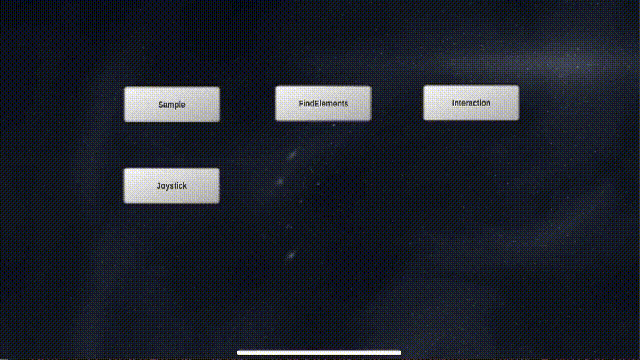

# GAutomator2(iOS for now)
  

UIAutomation Test Framework For Games ( iOS ONLY FOR NOW)

## Requirements

Python2.7/3.4+

### iOS Test Requirements:

#### Unity

Mac OS X 10.13.6+

XCode10 For iOS9\~12

Recommend Environment:Xcode10+iOS11

[wt-wda](../wt-wda "wt-wda")

[libimobiledevice](https://github.com/libimobiledevice/libimobiledevice "libimobiledevice")
 (`brew install libimobiledevice`)

#### UE4

Mac OS X 10.13.6+

XCode11+ For ios12+

Recommend Environment:Xcode11+ios13

[apm-wda](../apm-wda "apm-wda")

[libimobiledevice](https://github.com/libimobiledevice/libimobiledevice "libimobiledevice")
 (`brew install libimobiledevice`)

## Installation

RUN:
`python setup.py install`

## Usage
### iOS Test Steps:

0.make sure your game has integrated with [GAutomator SDK](../GAutomatorSdk/UnitySDK/compiled)

1.connect you iPhone to Mac by USB and get your device udid(`idevice_id -l`)

2.1 Unity: build && run wt-wda(or WebDriverAgent) on the target device by xcodebuild(see [wt-wda](../wt-wda) for details

UE4: build && run apm-wda(or Appium/WebDriverAgent) on the target device by xcodebuild(see [apm-wda](../apm-wda) for details

3.run `iproxy $your_port 8100 $your_udid`

4.edit and run scripts with ga2 (See sample/IOSTestTutorial for details)

### Record and Playback
We offer a recorder plugin for Pycharm. See [docs/GA Recorder.md](docs/GA%20Recorder.md) for interfaces.

## Sample
### iOS Sample:
demo ipa files: ([Unity UGUI](https://cdn.wetest.qq.com/com/c/ugui.ipa) and [Unity  NGUI](https://cdn.wetest.qq.com/com/c/ngui.ipa))

ios test sample code : [sample/iOSTestTutorial.py](sample/IOSTestTutorial.py) (just edit the udid before run)

## Contribution
[ga2_contrib](ga2_contrib) package is intended for development of so-called "extra" modules, contributed functionality. 

[login\_helper](ga2\_contrib/login\_helper) is an extension on logining wechat/qq. 

[sample\_engine\_extension](ga2_contrib/sample_engine_extention) is a demo about how to support other engine types .

if you want to install both ga2 and ga2_contrib packages:
RUN:
`env ENABLE_CONTRIB=1 python setup.py install --user`

## Commit Your Script to WeTest Cloud
1. rename your entry script with "main.py" 
2. go to https://wetest.qq.com/console/cloud/autotest
3. upload the ipa file signed by a enterprise development certificate.
4. pack your "main.py" with any other files into a ".zip" and upload the zip as scripts
5. choose iPhones in device list and start the test.

## Thanks
WebDriverAgent: https://github.com/facebook/WebDriverAgent

Appium/WebDriverAgent: https://github.com/appium/WebDriverAgent

openatx/facebook-wda: https://github.com/openatx/facebook-wda

libimobiledevice: https://github.com/libimobiledevice/libimobiledevice

