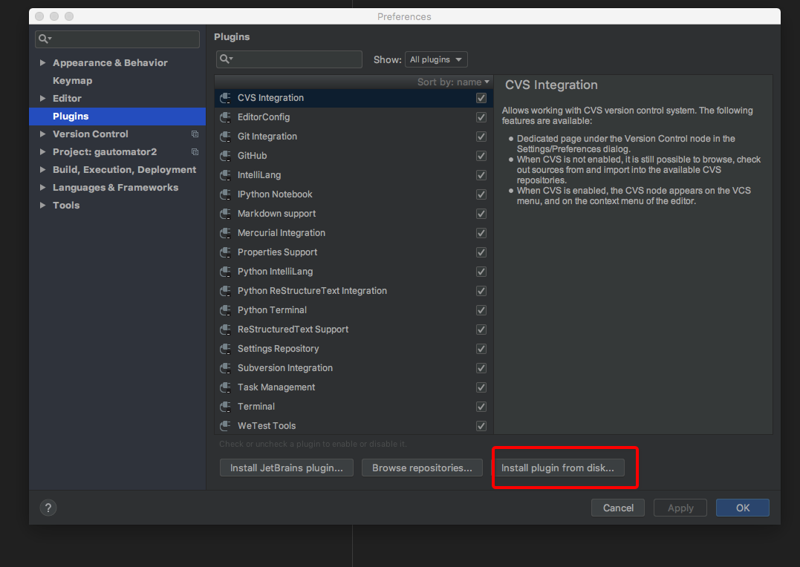
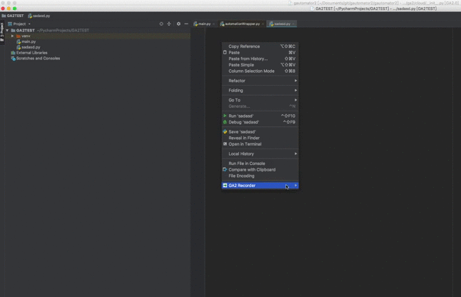
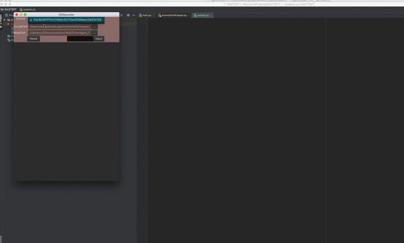
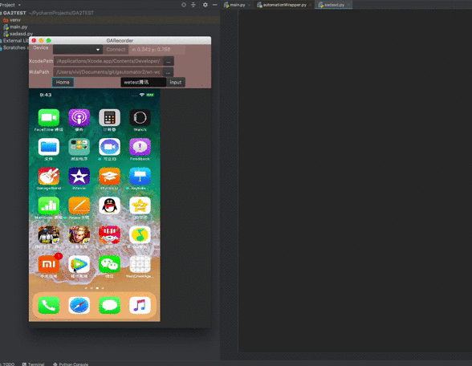
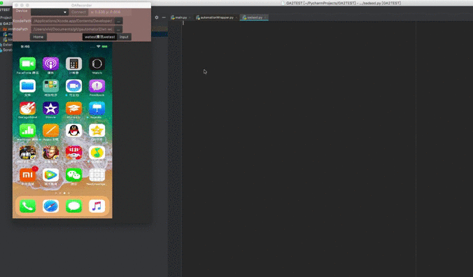
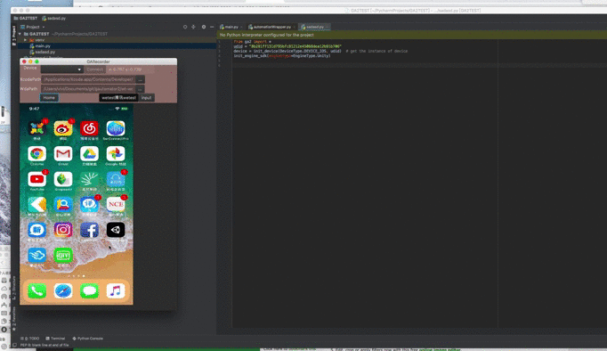
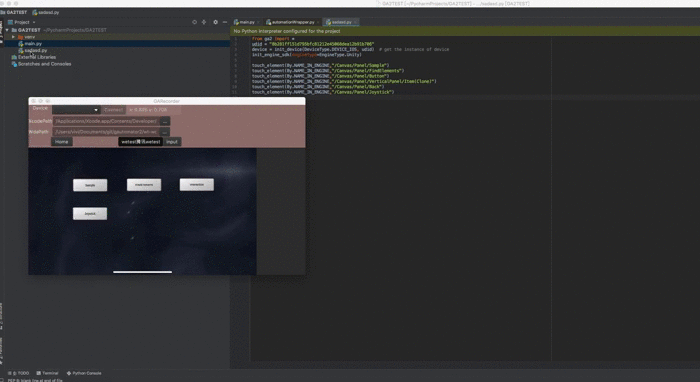

# GA-Recorder For Pycharm 
Element Operation Recorder Tools ( iOS ONLY FOR NOW).
Support unity element locating and touching only for now.

## Requirements
* Mac OS X 10.13+(For iOS)
* Pycharm
* Xcode 10
* libimobiledevice(`brew install libimobiledevice`)
* [wt-wda](../../wt-wda)

## Installation
* Make sure  wt-wda is able to start on your device. `iproxy` and `idevice_id -l` are installed in your PC.
* Download the pycharm plugin  package [GA Recorder](http://cdn.wetest.qq.com/com/c/wetest_plugin_pycharm.zip) 
* Open PyCharm Preference , install the plugin from disk , select the zip and restart PyCharm.

* on Mac OS X, find the plugin path according to your IDE version (e.g. ~/Library/Application\ Support/PyCharmCEXXXXXX/wetest_plugin_pycharm/), run the following commands :    
`cp $(which iproxy ) ~/Library/Application\ Support/PyCharmCEXXXXXX/wetest_plugin_pycharm/`   
`cp $(which idevice_id ) ~/Library/Application\ Support/PyCharmCEXXXXXX/wetest_plugin_pycharm/`

## Usage
### Connect Device
Connect you iPhone to Mac by lighting cable, make sure it's able to be fonud by `idevice_id -l`.
### Open GARecorder 
In PyCharm, right click on the editor in any script, choose "start recording" in "GA Recorder".

### Select Device and Wt-wda Path
Select your target device, set the pathes, click the "connect" button and wait for wda initialze on device(may take 10~30seconds depending on iPhone Type)

### Interact with Device
After loading , the device screen will mapped to the window, and you're able to do touch, swipe and input operations in window. 

### Generate Init Code
In PyCharm, right click on the editor in any script, choose "generate init code" in "GA Recorder".
Some initialize code will be inputed to editor.

### Generate Element Locating Code
Launch your game integrated with GA SDK , pressdown and hold the "ALT" key , move your mouse to the target element, the element info will be shown, and you may select it and record touch or wait operation.

### Playback 
Run the script in pycharm. ( If the recorder window is closed, you have to launch wda and iproxy manually before running GA scripts.

