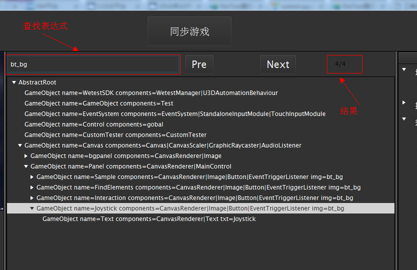
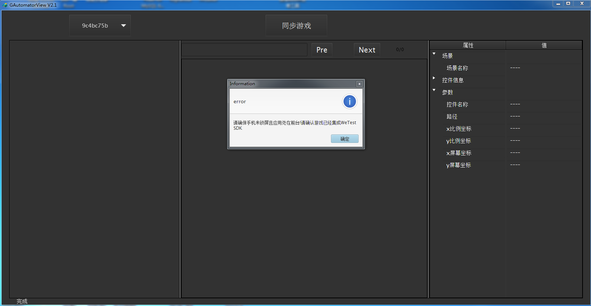

# GAutomatorView游戏控件查看器

GAutomatorView工具可在http://wetest.qq.com/cloud/index.php/phone/blrooike 下载，GAutomatorView为绿色软件打开即用（**注：请勿将该软件放置在中文目录下**）。 GAutomator主要根据，Unity游戏中的GameObject的路径名称来编写逻辑。类似于UIAutomator需要有一个，控件查看器。GAutomator也提供了一款类似的，Unity游戏中控件查看器。

GAutomatorView点击查找控件，目前仅支持NGUI和UGUI控件的查找。如果是3D物体，建议向开发询问物体对应的GameObject名称或者component名称，通过搜索的方式查找。

## 一、GAutomatorView使用方式
step 1:拉起集成SDK的游戏

step 2:同步游戏点击同步按钮

step 3:点击左侧游戏界面对应查找控件的位置。

step 4:中间控件树右击可复制

## 二、功能简介
1、UI控件查看：同步游戏之后，点击左侧游戏图像，找到Unity游戏中表示该UI控件的GameObject。
2、坐标查看：同步游戏后，鼠标移动在左侧游戏画面上时，在GAutomatorView的左下角能够显示屏幕坐标。x,y为android坐标系下，当前手机的x,y坐标值；scaleX=x/screenWidth,scaleY=y/screenHeight。scaleX、scaleY在测试时，可以根据手机长宽还原为当前手机的x,y坐标，不同分辨率下也有一定适用性。
3、搜索：支持正则表达式，搜索包括GameObject名称、components名称、txt文字内容、img图片名称在内的所有控件。

## 三、常见问题
**Q：GAutomatorView崩溃？**
A：GAutomatorView目前不支持中文目录，请勿将GAutomatorView移动到非中文目录下

**Q：无法同步游戏？**

A：请确保游戏已经拉起，且拉起的游戏已经集成SDK

**Q：点击无法查找到控件？**
A：1.非NGUI及UGUI UI无法通过点击的方式查找到；2、NGUI源码的事件模块如果进行过修改可能会让这部分功能无效；3、请确保SDK集成成功，u3dautomation.jar已经集成到游戏之中。
