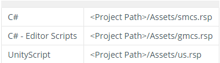

WeTest SDK是专门给予Unity引擎开发的组件感知、组件操作和崩溃异常捕获组件，能够感知和查询Unity的组件信息，比提供对应的操作。SDK目前只支持Android平台，IOS平台能够编译，但是无效。WeTest SDK分为NGUI和UGUI版本，请根据自己的游戏下载对应的版本。SDK文件包括

GAutomator并不是一个跨进程的自动化测试框架，需要用户在测试的游戏中集成WeTest SDK。WeTest SDK在游戏端启动一个服务，接受来自pc python脚本的命令，提供包括获取游戏组件、获取位置信息、执行点击、捕获异常等。SDK目前只支持Android平台，IOS平台能够编译，但是无效。WeTest SDK分为NGUI和UGUI版本，请根据自己的游戏下载对应的版本。SDK文件包括
**注：对外发布版本不可接入SDK！！！**
```
- libcrashmonitor.so
- u3dautomation.jar
- U3DAutomation.dll
```
**step 1:导入Unity项目工程**
1. U3DAutomation.dll中包含一个WeTest.U3DAutomation.U3DAutomationBehaviour组件，放在Assets目录下的任意位置均可。
2. libcrashmonitor.so、u3dautomation.jar需要被打包进游戏,一把放在Assets\Plugins\Android或Builds\Plugin\Android目录下

`
如果使用python来进行编译。可以使用脚本来拷贝，上述三个文件。编译完成后，从workspace目录中删除，这样可以避免发布版本带入WeTest SDK。
`

**step 2:初始化WeTest SDK**
选择第一个场景（Scene）,创建一个空的GameObject，然后挂载WeTest.U3DAutomation.U3DAutomationBehaviour组件
```C#
public class WeTestManager : MonoBehaviour {

    Application.LogCallback logCall;
	void Start () {
#if WETEST_SDK
        this.gameObject.AddComponent<WeTest.U3DAutomation.U3DAutomationBehaviour>();
        //this.gameObject.AddComponent<BuglyInitScript>();
        //BuglyAgent.RegisterLogCallback(WeTest.U3DAutomation.CrashMonitor._OnLogCallbackHandler);
#endif
        
    }
}
```
可以通过宏定义，来控制是否接入WeTest SDK。smcs.rsp和gmcs.rsp，两个文件控制预编译内容

```python
def ModifyMacro(workSpacePath, appName, mode):
    fsmcs = open(workSpacePath + /Assets/smcs.rsp", 'w')
    fgmcs = open(workSpacePath + /Assets/gmcs.rsp", 'w')

    if mode == "debug":
        fsmcs.write("-define:WETEST_SDK")
        fgmcs.write("-define:WETEST_SDK")

```
**step 3:检查是否接入成功**
apk包编译好之后，拉起游戏，同时通过logcat查看日志
`adb logcat -vthreadtime -s Unity`
如果看到U3DAutomation Init OK代表，已经接入成功。


**FAQ**
1、集成Bugly或其他异常捕获组件
可以将WeTest.U3DAutomation.CrashMonitor._OnLogCallbackHandler，注册给其他组件的回调函数。如，Bugly可以用下面的代码，做兼容。
```python
public class WeTestManager : MonoBehaviour {

    Application.LogCallback logCall;
	void Start () {
#if WETEST_SDK
        this.gameObject.AddComponent<WeTest.U3DAutomation.U3DAutomationBehaviour>();
        BuglyAgent.RegisterLogCallback(WeTest.U3DAutomation.CrashMonitor._OnLogCallbackHandler);
#endif
        
    }
}
```